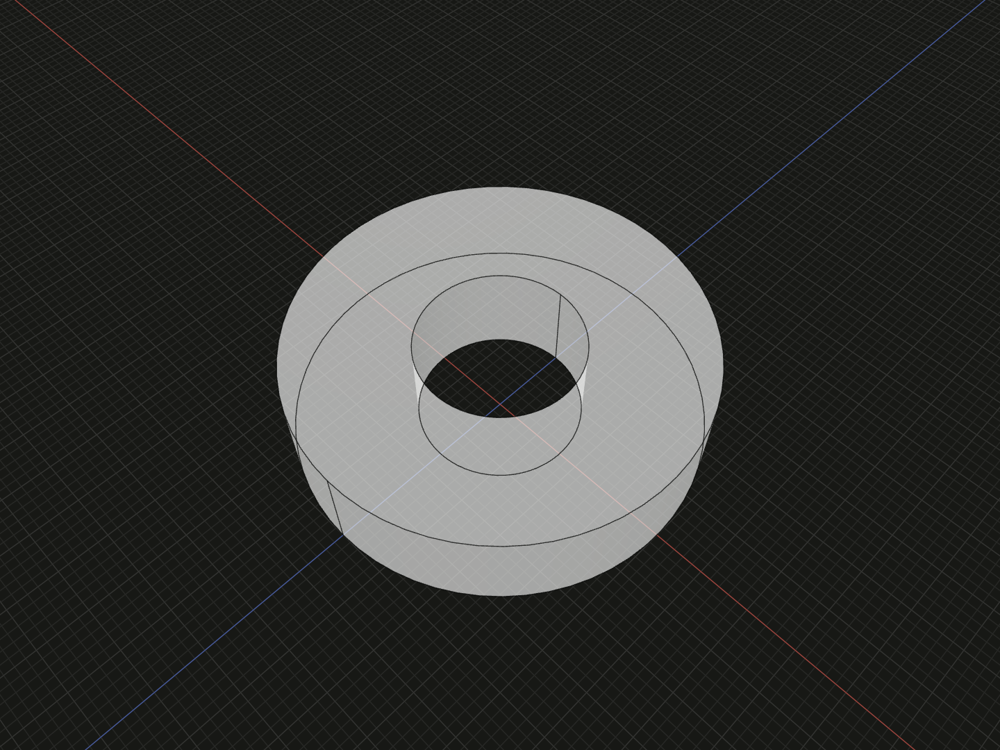

Reference defining-layer points and add immutable local geometry over an upstream sketch.

## Example

```ts
import {sketch} from '@code3d/core';

const upstream = sketch([
  ['point', 1, [0, 0]],
  ['circle', 2, [1, 20]],
]);
export const derivedProfile = upstream.derive(
  [
    ['point', 1, upstream.point(1)],
    ['circle', 2, [1, 3]],
  ],
  {constraints: [['radius', 2, 8]]},
);
export const sleevePart = derivedProfile.face().extrude(10);
```



Complete example: [sketch API example](../../../app/examples/sketches/sketch-api.ts).

## Signature

```ts
sketchValue.point(id: number): SketchPoint;
interface SketchPoint { readonly sketch: Sketch; readonly id: number; }
sketchValue.derive(entries?: readonly SketchEntry[], options?: SketchOptions): Sketch;
```

Import the functions and named types from `@code3d/core`.

Construction roles belong to their defining layer. Upstream construction curves
stay excluded from face boundaries, while their points can still be referenced by
ordinary local curves. Edit the upstream definition to change an upstream role.

## point

`point(id)` returns a registered reference to a point defined in this sketch
layer. It throws if that local ID is unknown or identifies a curve. `SketchPoint`
contains readonly `sketch` and `id`, preserving the defining layer rather than
just a number. Construct it with this method; a plain object with the same fields
is not a valid reference.

The value is accepted as a point source in derived entity tuples and constraints.
It is not a 3D `PointAnchor`, has no x/y properties, and cannot be passed directly
to [align](align.md) or B-Rep vertex operations. A local alias has its own ID while
resolving to the same geometric point as its target.

## derive

`derive(entries?, options?)` adds a new layer, with empty entries and constraints
by default. The receiver and its ancestor layers are retained as read-only
inputs. New IDs belong to the new layer and may reuse upstream numbers without
replacing upstream entities. Numeric point references address only this layer;
use `ancestor.point(id)` to refer to upstream points.

The example reuses the upstream center, starts a new radius at 3 and solves it
to 8. The radius-20 upstream circle is still present, so the resulting face is
an annulus and the sleeve volume is `3360 * Math.PI`. Neither the upstream
circle nor its coordinates are changed.

References must belong to real ancestors. Sibling sketches and unrelated values
are rejected. Ancestors further up the chain are valid. A spatial copy produced
by [relate](sketch-relate.md) shares the original 2D definition identity, so its
original point references still identify the upstream geometry.

## Layering and extracted geometry

Ordinary upstream curves participate in [region extraction](sketch-faces.md) together
with local curves. A derived layer does not automatically trim or replace them;
overlapping new boundaries can make extraction invalid. Constraints cannot move
upstream points to satisfy local conditions. Derived layers inherit the upstream
spatial relation frame while retaining their own 2D authored data.

Creating a new upstream value later does not retarget an existing derived layer.
Rebuild the chain from the desired source. For reusable profiles, keep meaningful
layer variables and point IDs stable; do not treat extraction-array order or
resulting B-Rep IDs as persistent sketch identity.
