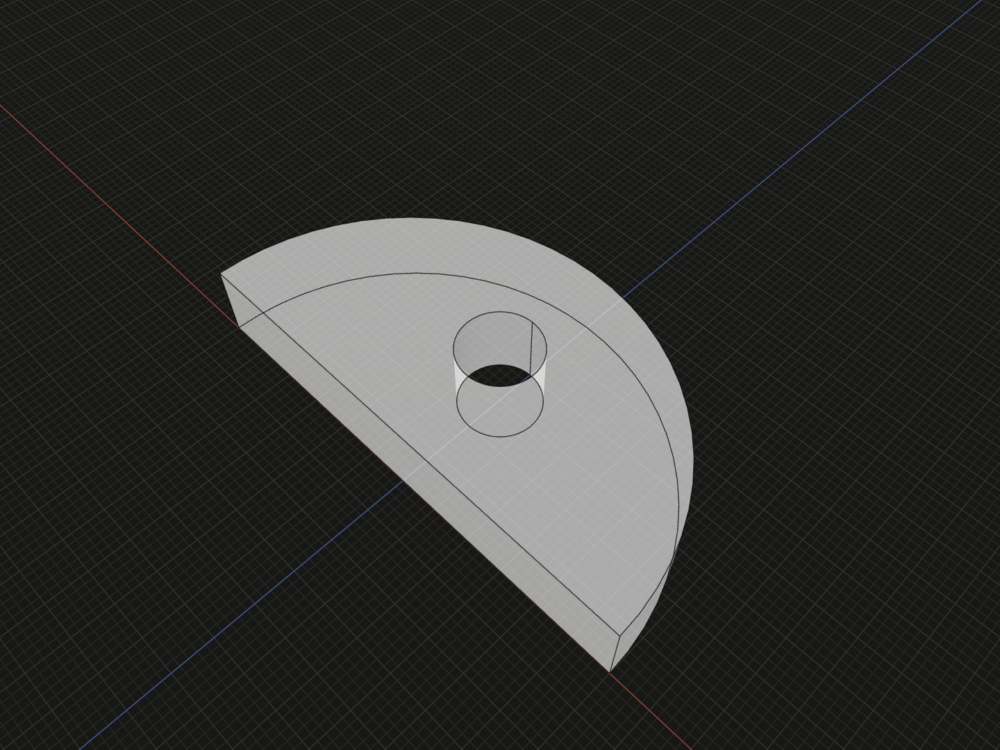

Author points, lines, circles and directed circular arcs with layer-local IDs.

## Example

```ts
import {sketch} from '@code3d/core';

export const entityProfile = sketch([
  ['point', 1, [0, 0]],
  ['point', 2, [6, 0]],
  ['point', 3, [-6, 0]],
  ['arc', 4, [1, 6, 2, 3, 'ccw']],
  ['line', 5, [3, 2]],
  ['point', 6, [0, 3]],
  ['point', 7, 6],
  ['circle', 8, [7, 1]],
]);
export const entityPart = entityProfile.face().extrude(2);
```



Complete example: [sketch API example](../../../app/examples/sketches/sketch-api.ts).

## Signature

```ts
type SketchPosition = readonly [x: number, y: number];
type SketchArcDirection = 'cw' | 'ccw';
type SketchEntry =
  | readonly ['point', number, SketchPosition | number | SketchPoint]
  | readonly [
      'line' | 'aux:line',
      number,
      readonly [number | SketchPoint, number | SketchPoint],
    ]
  | readonly [
      'circle' | 'aux:circle',
      number,
      readonly [number | SketchPoint, number],
    ]
  | readonly [
      'arc' | 'aux:arc',
      number,
      readonly [
        number | SketchPoint,
        number,
        number | SketchPoint,
        number | SketchPoint,
        SketchArcDirection,
      ],
    ];
```

Import the functions and named types from `@code3d/core`.

## IDs and references

All entity kinds share the layer's ID namespace. IDs must be unique positive
safe integers; they are not tuple-array offsets. A numeric point reference always
addresses a point in the current layer, including a forward declaration.
A `SketchPoint` must come from a real ancestor via [point](sketch-derive.md#point).
A same-numbered point in another sketch is not implicitly shared. B-Rep vertex
and edge IDs cannot be used to address sketch entities.

## point

`['point', id, [x, y]]` introduces two finite coordinates in sketch model units.
`['point', id, localPointId]` creates an alias to the same geometric point;
`['point', id, upstream.point(pointId)]` creates an alias to read-only upstream
geometry in a derived layer. An alias keeps its own authored ID but introduces
no independent coordinate freedom. Cyclic aliases and missing targets fail.

The example's point 7 aliases point 6. Editing either local alias addresses the
same coordinates, so they are not two coincident-but-independent points.

## line

`['line', id, [start, end]]` creates a straight finite segment between point
references. Their authored order defines the positive line direction for angle
constraints. A line has no independent numeric coordinates or radius. Coincident
endpoints are degenerate; connect distinct points and apply [constraints](sketch-constraints.md)
when design intent requires a length or orientation.

## circle

`['circle', id, [center, radius]]` creates a full circle. Radius must initially
be positive and finite. It is a current value that the solver may change; add a
`radius` constraint to make it persistent. The example's circle uses aliased
center 7 and becomes a hole inside the semicircular boundary.

## arc

`['arc', id, [center, radius, start, end, direction]]` creates a circular arc.
The center and two endpoints are point references; radius is positive and finite.
`direction` is exactly `cw` or `ccw`, viewed in the sketch's XY coordinates.
The example uses the counterclockwise upper semicircle from `[6, 0]` to `[-6, 0]`.
Together with its closing line, the hole leaves face area `17 * Math.PI`.

The solver maintains endpoint-on-circle conditions as structural equations.
Starting coordinates and radius can be adjusted to satisfy them and any authored
constraints. Center-coincident or identical endpoints are degenerate; use
`circle` for a full turn. Direction selects which traversal connects the endpoints;
a persistent `sweep` constraint sets its magnitude in degrees.

## Construction geometry

Use the `aux:` type prefix for reference geometry:
`['aux:line', id, [start, end]]`, `['aux:circle', id, [center, radius]]`, or
`['aux:arc', id, [center, radius, start, end, 'cw']]`. All entries remain three-item
tuples; the geometry parameters, IDs, point references and constraints are unchanged.
These curves remain available for snapping and editing, but are excluded from
[face boundaries](sketch-faces.md). Auxiliary circles do not create holes or islands.
Points never contribute boundaries and have no auxiliary variant.

Remove `aux:` to restore an ordinary boundary. Derived layers preserve upstream
construction roles. In the App, select local curves and use **Construction** to
add or remove the prefix. Curves appear dashed in both the sketch editor and 3D
view. A displayed interval selects the entire authored curve. Trimming keeps the
prefix on surviving pieces; Undo/Redo restores the source and display. Computed
type names remain controlled by code and cannot be replaced by visual edits.

## Data versus constraints

Entity tuples describe current geometry. [Constraints](sketch-constraints.md)
are separate tuples with no persistent IDs. Derived layers retain upstream
curves and cannot replace them merely by reusing their numbers. Invalid radius,
malformed tuples, missing point references and duplicate IDs throw during sketch
construction; invalid closed boundaries can fail later during [face extraction](sketch-faces.md).
