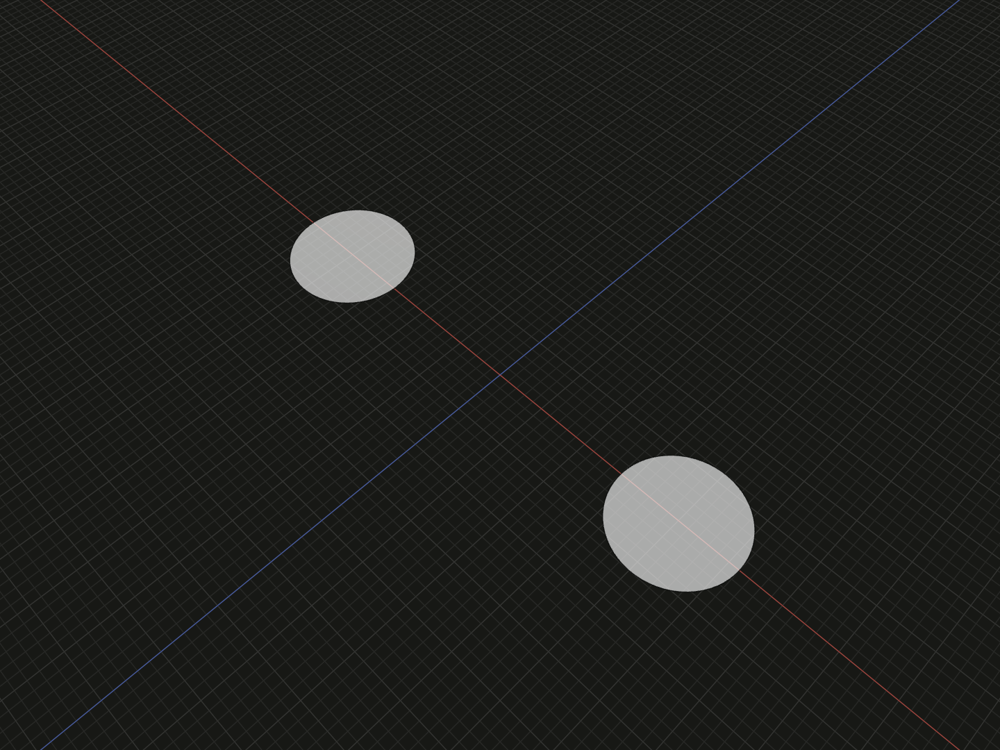

Extract finite faces from closed sketch boundaries, including holes and separate regions.

## Example

```ts
import {sketch} from '@code3d/core';

export const holesProfile = sketch([
  ['point', 1, [-10, 0]],
  ['circle', 2, [1, 3]],
  ['point', 3, [10, 0]],
  ['circle', 4, [3, 3]],
]);
export const regionParts = holesProfile.faces().map(face => face.extrude(5));
```



Complete example: [sketch API example](../../../app/examples/sketches/sketch-api.ts).

## Signature

```ts
sketchValue.face(): FaceModel;
sketchValue.faces(): readonly FaceModel[];
```

Import the functions and named types from `@code3d/core`.

## face

`face()` requires exactly one closed material region and returns one `FaceModel`.
That region can include holes. An empty sketch or multiple disconnected material
regions causes an error with the region count; use `faces()` when several are
intended. This is the bridge from 2D definitions to B-Rep modeling.

## faces

`faces()` returns an ordinary readonly array of all regions. An empty definition
has no regions and returns `[]`. The example returns two radius-3 disks and then
two solids, each with volume `45 * Math.PI`. Array order is not a persistent region
identity and there is no broadcast modeling method on the array. Use `map` for
separate modeling operations or pass a face array to a supported overload such
as [extrude](extrude.md).

## Boundaries, holes and islands

Extraction includes all local and upstream-layer boundaries. Separate contours
produce separate faces. Nested contours alternate material, holes and islands:
an outer circle with an inner circle gives one annular face; a third circle
inside that hole adds another material island. Standalone point entities do not
create regions, and aliases do not duplicate boundaries.

Lines and arcs must form closed, nonbranching contours. Open, crossing, touching,
overlapping, degenerate or branching boundaries report an error; extraction does
not infer arbitrary trims or split a crossing into regions. Complete or trim
these boundaries before requesting a face. An unfinished sketch remains useful
for editing and inspection even when face construction cannot succeed.

## Coordinates and model operations

Sketch `[x, y]` becomes model `[x, 0, -y]`, preserving its authored origin. Faces
inherit the sketch's [placement relations](sketch-relate.md). Positive extrusion
follows the local +Y plane normal; negative extrusion reverses it. Rotating a
face rotates that normal. These are finite model values with ordinary face
capabilities, including area, topology and extrusion.

The returned `FaceModel` does not expose authored sketch point IDs as B-Rep IDs.
Persistent region IDs and general automatic hole correspondence are unavailable.
For [loft](loft.md), use one face per section and observe its supported matching
hole count; a successful face extraction alone does not guarantee any subsequent
solid operation will succeed.
