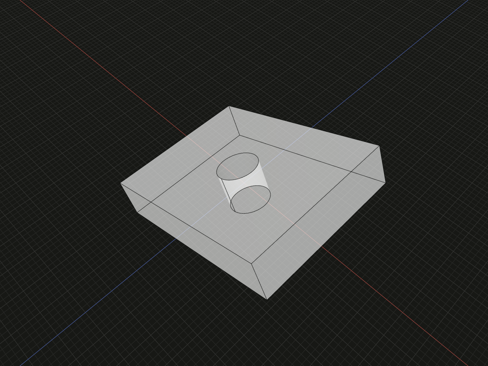

Position an immutable sketch plane against model geometry before extracting faces.

## Example

```ts
import {align, box, sketch} from '@code3d/core';

const sketchHost = box(40, 8, 30).rotate(0, 0, 25);
const localProfile = sketch([
  ['point', 1, [0, 0]],
  ['circle', 2, [1, 4]],
]);
export const placedProfile = localProfile.relate(self =>
  align(self.plane, sketchHost.surface(4)),
);
export const drilledHost = sketchHost.cut([placedProfile.face().extrude(-8)]);
```



Complete example: [sketch API example](../../../app/examples/sketches/sketch-api.ts).

## Signature

```ts
sketchValue.plane: FaceAnchor;
sketchValue.relate(build: (self: Sketch) => Relation | readonly Relation[]): Sketch;
```

Import the functions and named types from `@code3d/core`.

## plane

Every sketch supplies its unbounded XZ plane with normal +Y, including empty and
open sketches with no closed regions. It is a `FaceAnchor`, not finite geometry.
`plane.flip()` reverses its reference normal sense. The two-dimensional definition
maps `[x, y]` to `[x, 0, -y]` before the spatial placement is applied.

## relate

`relate` creates a new spatial value sharing the same immutable 2D definition.
Its callback receives the new `self`; every returned constraint must involve
that value. References to the original sketch keep their original frame. Return
one complete `Constraint` or `Transformation`, or a readonly array of them.

Use [align](align.md) to coincide its plane with a named model plane or planar
surface. Directed plane coincidence matches normal and plane location but does
not center a profile on the target's finite trim. Remaining in-plane coordinates
follow the same solver rules as model relations. Add deliberate relations or
placement transformations when specific in-plane positioning is required.

The example aligns to the rotated host's +Y surface and extrudes backward into
its material. The original localProfile remains unchanged. Relations bind the
actual immutable target model; creating a later transformed host does not retarget
the sketch automatically.

## Placement inheritance and limits

Derived layers, extracted faces and extrusion inherit the sketch's relations.
They are resolved at modeling/composition boundaries, without rewriting sketch
tuple coordinates. Empty and open sketches can be related before face extraction.
Use ordinary [offset](offset.md), [rotate](rotate.md) and applicable pivot/axis
selectors for additional placement steps under the model relation rules.

The sketch plane is infinite, so finite-bound [on](on.md) cannot use it as finite
contact geometry. Topology selectors such as `pivotVertex` and `axisEdge` require
an actual geometric model. A sketch is not a group member or a solid tool; use
its extracted and optionally extruded model value for those operations.

## Editing a related sketch

Select the related value and choose **Edit sketch** to see read-only model
outlines in the sketch plane. Select the original value for its local view.
Both edit the same source definition. Context outlines are visual references;
they do not become snapping targets or imported geometry constraints. See the
[sketch workflow](../sketches.md) and [mounting plate example](../../../app/examples/sketches/mounting-plate.ts).
