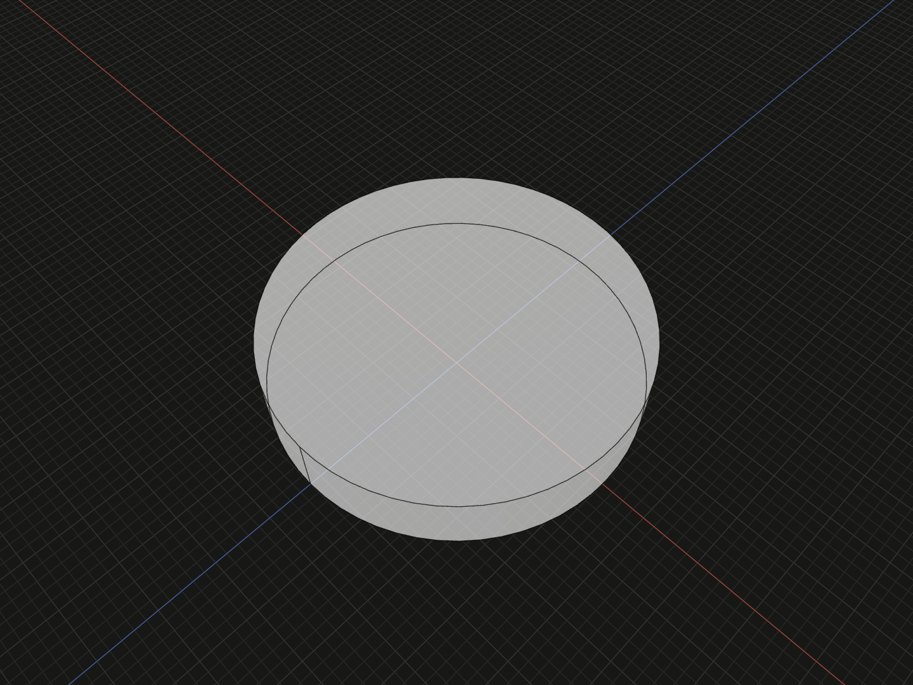

Define immutable two-dimensional sketch geometry and constraints before building faces.

## Example

```ts
import {sketch} from '@code3d/core';

export const basicProfile = sketch(
  [
    ['point', 1, [0, 0]],
    ['circle', 2, [1, 8]],
  ],
  {
    constraints: [
      ['fixed', 1],
      ['radius', 2, 8],
    ],
  },
);
export const basicPart = basicProfile.face().extrude(3);
```



Complete example: [sketch API example](../../../app/examples/sketches/sketch-api.ts).

## Signature

```ts
function sketch(
  entries?: readonly SketchEntry[],
  options?: SketchOptions,
): Sketch;
type SketchOptions = Readonly<{constraints?: readonly SketchConstraint[]}>;
```

Import the functions and named types from `@code3d/core`.

## Definition and options

`entries` defaults to an empty array. Each [entity tuple](sketch-entities.md)
contains its kind, positive safe-integer ID and geometry data. IDs share one
namespace per layer. `options.constraints` defaults to `[]`; its tuples express
conditions that must remain true during solving and editing. Geometry inputs are
current values or starting guesses, not automatically fixed dimensions.

Construction copies entries and constraints and solves the local definition.
The return is a `Sketch`, distinct from a B-Rep model. Changing an input array
later does not edit it. Creating another sketch, deriving a layer or relating
its plane returns a new value. The example fixes a center and radius, then builds
a disk of area `64 * Math.PI` and a cylinder of volume `192 * Math.PI`.

## Coordinates and capabilities

`SketchPosition` is a readonly `[x, y]` tuple in model units. In 3D it maps to
`[x, 0, -y]`, without recentering. The sketch plane's normal is +Y. Coordinates
and angular constraints therefore refer to the two-dimensional sketch axes,
not global Y elevation.

| Member                       | Purpose                                                                         |
| ---------------------------- | ------------------------------------------------------------------------------- |
| `plane`, `relate(build)`     | [Relate the sketch plane](sketch-relate.md), even before a closed region exists |
| `point(id)`                  | [Reference a point](sketch-derive.md#point) with its defining layer identity    |
| `derive(entries?, options?)` | [Add a local layer](sketch-derive.md) over read-only upstream geometry          |
| `face()`, `faces()`          | [Create finite faces](sketch-faces.md) from closed regions                      |

A sketch has no solid modifications, B-Rep topology selectors or direct extrusion
method. Extract a face first. Sketch entity IDs differ from the resulting face's
topology IDs. Empty and open definitions can be displayed and related without
producing a face.

## Solving and editing

Underdetermined sketches are valid; their remaining freedom uses the current
geometry as a starting point. Conflicting conditions or degenerate geometry
can fail during construction. See [constraints](sketch-constraints.md) for target
validation, angular conventions and diagnostics. A host of the low-level browser
entry must install the sketch solver; the App and Node entry initialize it.

Select the sketch expression or variable in App to inspect its solved points and
curves. **Edit sketch** opens the 2D editor; **Finish sketch** returns to 3D.
Edits update source entries and constraints with ordinary undo. See the
[sketch workflow](../sketches.md) for interactive editing and the
[agent sketch guide](../../../../docs/agents/sketches.md) for observation data.
