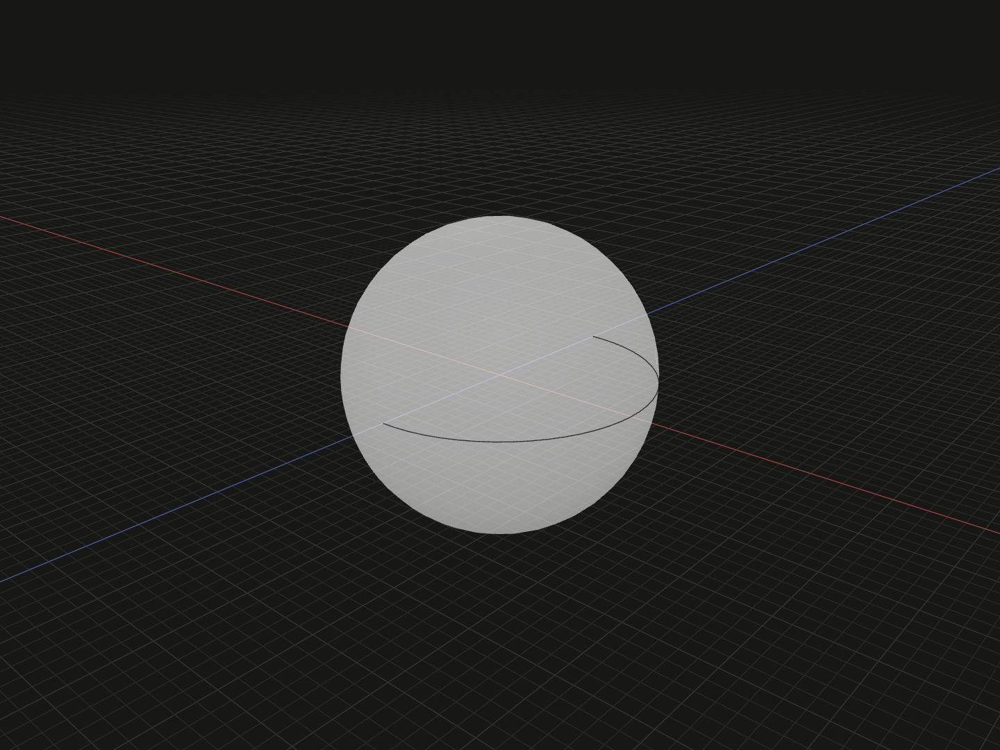

Create a spherical solid for a ball, rounded feature or Boolean tool. One radius determines the size in every direction.

## Example

```ts
import {sphere} from '@code3d/core';

export const ball = sphere(6);
```



Select `ball` in the App to inspect this solid. Select a numeric argument
and press Tab to edit it.

Complete example: [basic shapes](../../../app/examples/primitives/primitives.ts).

## Signature

```ts
function sphere(radius: number): SolidModel;
```

Import `sphere` and, when needed, `type SolidModel` from `@code3d/core`.
The same call works in the App and Node; Node initializes the kernel automatically.

## Parameters

| Parameter | Meaning                                 | Accepted values              |
| --------- | --------------------------------------- | ---------------------------- |
| `radius`  | Distance from the center to the surface | Finite and greater than zero |

The parameter is required in TypeScript. Lengths use the model's common units;
see [export scale](../../../web/src/content/docs/docs/guides/exporting.md#scale-and-orientation).

## Result and coordinates

Returns a `SolidModel<CanonicalElements>` centered at the local origin.
X, Y and Z each span `-radius` to `radius`. The example has a diameter of 12
and bounds from `[-6, -6, -6]` to `[6, 6, 6]`.

The initial `.origin` and `.center` coincide at `[0, 0, 0]`. Its `.axis` is
a +Y reference line through that point, useful for placement even though the
sphere has no unique physical rotation axis. Directional bounds identify
extreme positions; `.up` and `.down` are not planar caps on the sphere.

For an elongated or flattened shape with independent radii, use
[`ellipsoid`](ellipsoid.md).

The solid provides frame, origin, center, axis and directional bound references.
It supports Boolean operations, fillets, chamfers, shelling, materials and relations.
Derived operations return new model values; see [model values](../values.md)
and [local coordinates](../local-coordinates.md).

## Measurements

Volume is `(4 / 3) * Math.PI * radius ** 3`; surface area is
`4 * Math.PI * radius ** 2`. For `sphere(6)`, `.volume` is approximately
`904.778684` and `.area` is approximately `452.389342`.

These measure the curved solid, not the volume or area of its bounding box.

## Validation and editing defaults

The radius must be a positive finite number. Zero, negative values, `NaN`,
infinities, `null` and numeric strings throw
`radius must be a positive finite number.`.

While an incomplete call is being edited, omitted or `undefined` arguments use
`radius = 5`. These runtime defaults let the editor
complete a call; they do not remove the required TypeScript arguments.
The resulting dimensions must still satisfy all constraints.
Very small dimensions or clearances can also encounter the modeling kernel's tolerance.

## Related APIs

- [ellipsoid](ellipsoid.md) gives X, Y and Z independent radii.
- [Booleans](../api.md#composition-and-boolean-operations) combine a sphere with other solids or use it as a cutter.
- [Solid primitives](../api.md#solid-primitives) compares the available starting shapes.
