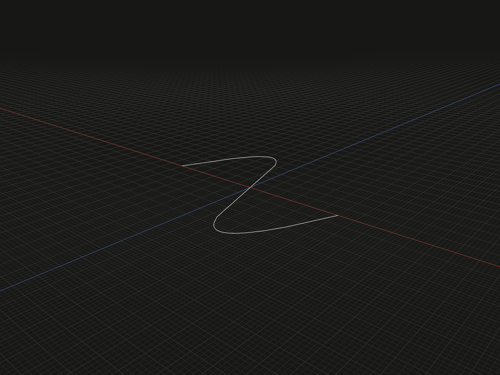

Fit one B-spline edge to an ordered list of local positions. Use it for a smooth path described by samples rather than Bézier control handles.

## Example

```ts
import {spline} from '@code3d/core';

export const fittedSpline = spline([
  [-6, 0, 0],
  [-2, 0, -5],
  [2, 0, 5],
  [6, 0, 0],
]);
```



Select `fittedSpline` in the App to inspect the geometry.

Complete example: [basic shapes](../../../app/examples/primitives/primitives.ts).

## Signature

```ts
function spline(points: readonly Vec3[]): EdgeModel;
```

Import the function and any named types above from `@code3d/core`.
The same call works in the App and Node; Node initializes the kernel automatically.

## Parameters

`points` is a required ordered array of at least two `readonly [x, y, z]` tuples.
Every component must be finite, and the input must contain at least two distinct
positions. Coordinates use the returned model's local frame and common length units.
Their order describes the progression of the fitted path.

These are fitting samples, not Bézier control points. The current implementation
uses B-spline approximation: it does not promise exact interpolation through
every supplied position. Do not depend on every sample becoming a point on the
result within exact arithmetic.

## Result and coordinates

The result is an `EdgeModel<CurveElements>` with one fitted edge and no filled
area or solid volume. The local origin stays at zero; the samples are not
recentered. Nonplanar sets may produce spatial curves.

`.start` and `.end` refer to the fitted edge's endpoints. `.midpoint` refers to
the middle of its parameter interval, not the middle array item or necessarily
half its arc length. `.center` is the resulting curve's bounding-box center.
All are references for modeling operations, not coordinate arrays.

`.length` measures the fitted edge. `.bounds()` measures its geometry, not merely
the input sample box. A fit can overshoot between samples, so do not use sample
extrema as guaranteed geometric bounds or clearance limits.
See [geometry measurements](bounds.md).

## Validation and fitting limits

Too few samples report `spline requires at least 2 points.` An all-identical
set reports `spline requires at least two distinct points.` Nonfinite coordinates
are rejected. Passing these checks does not guarantee that the kernel can fit
a usable curve; repeated or ill-conditioned samples can still fail.

The API does not expose fitting tolerance, degree, knots, weights, smoothing,
endpoint tangent constraints or periodic-closure options. It has no omitted-point
or editing defaults. A successful fit does not prove that the curve is free of
self-intersections; inspect the resulting path before using it for a solid sweep.

Use the result as a [sweep path](../api.md#path-sweeps) or
[loft spine](../api.md#profiles-and-curves). Position a sweep profile at the actual
path start and align its normal with the starting tangent.
The curve supports topology selection, transforms, materials and relations;
see [model values](../values.md) and [local coordinates](../local-coordinates.md).

## Related APIs

- [bezier](bezier.md) provides direct control-point shaping.
- [arc](arc.md) constrains the result to a circle through three positions.
- [line](line.md) constructs a straight edge without a fitting step.
