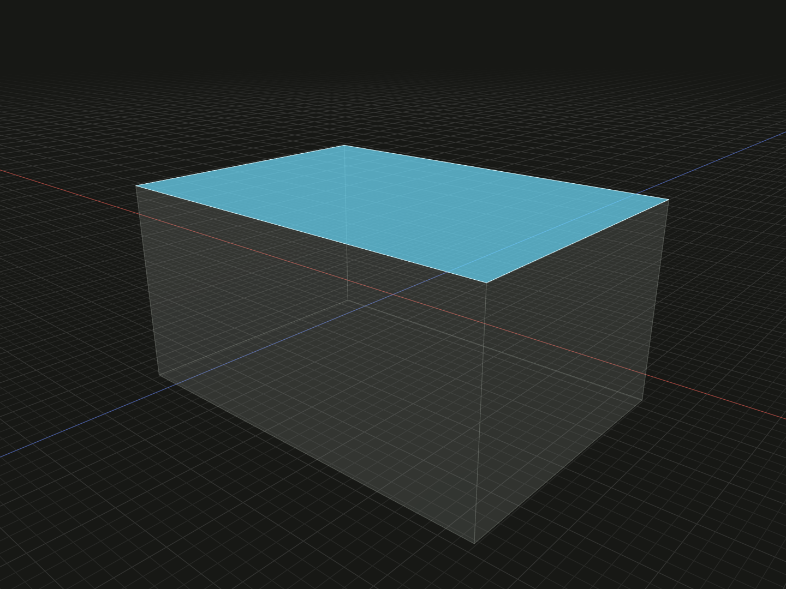

Select finite surface references from a body or face model.

## Example

```ts
import {box} from '@code3d/core';

export const bodyS = box(20, 10, 14);
export const topFace = bodyS.surface(4);
export const endFaces = bodyS.surfaces([3, 4]);
```



Complete example: [topology and references](../../../app/examples/operations/topology-api.ts).

## Signature

```ts
receiver.surface(id: SurfaceId): Surface;
receiver.surfaces(ids?: readonly SurfaceId[]): readonly Surface[];
```

Import the functions and named types from `@code3d/core`.

## Receivers and result

Solid and face models provide surface selection. `Solid` and `Surface` references
provide their contained surfaces. Groups do not supply a shared surface numbering
scheme. A selected `Surface` references a finite trimmed face; it does not create
a `FaceModel` that can be extruded or thickened directly.

The example selects the unmodified box's S4, its +Y face, with area 280. Use its
ID in [shell](shell.md) to select an opening. Use the reference in
[align](align.md), [wrap](wrap.md), directional bounds and measurement.

## Surface properties

`kind` is `surface` and `id` is its `SurfaceId`. A surface is a `FaceAnchor` with
`center`, `area`, `flip()`, six directional bounds, and vertex/edge/surface selection.
Area measures only its finite trimmed region, subtracting holes.

`flip()` reverses normal sense for reference operations while keeping the finite
geometry, position and reference axes. It does not construct a face model with
reversed BRep geometry. See [flip and reverse](flip-reverse.md).

A `Surface` need not be planar. Geometry alignment uses the complete supporting
surface and can ignore trimming; [wrap](wrap.md) instead requires its finite
trimmed domain to contain the mapped layout. Use the model's `plane` reference
when a planar constructor intentionally publishes an infinite plane.

## IDs and selection order

IDs belong to the original geometry's topology namespace, not to an array index
or the entire application. A valid ID is a positive integer or a readonly path
of at least two positive integers. `[1, 4]` as a plural selection requests two
IDs; `[[1, 4]]` requests one inherited path. Display labels such as `E2` or
`S[1,4]` are not accepted as string IDs.

Omitting the plural argument returns all available elements in topology order.
An explicit ID array preserves authored order and duplicates. An empty array
returns `[]`. Malformed, unknown or retired IDs throw. Selecting through a child
reference also checks membership: an ID elsewhere on the body cannot be selected
through an unrelated surface or edge.

Child queries retain the original namespace rather than renumbering from one.
Booleans and other construction operations may prefix inherited IDs with their
input position; local edits preserve surviving IDs and retire replaced ones.
Use the current result's topology after an edit. See
[topology lineage](../topology.md#ids-belong-to-a-model).
