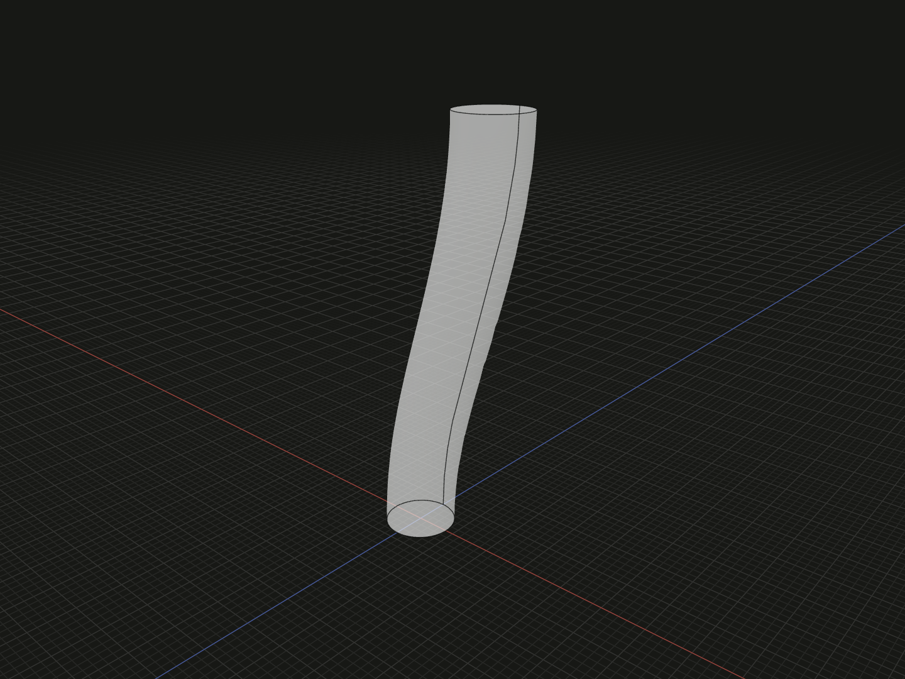

Carry a planar face along an open curve to make a solid. Author the starting alignment explicitly: the profile origin must meet the path start and its normal must match the starting tangent.

## Example

```ts
import {bezier, circle, sweep} from '@code3d/core';

const profile = circle(2);
const spine = bezier([
  [0, 0, 0],
  [0, 8, 0],
  [5, 16, 0],
  [5, 24, 0],
]);
export const bentRod = sweep(profile, spine);
```



Complete example: [shape construction](../../../app/examples/operations/shape-construction.ts).

## Signature

```ts
function sweep(profile: FaceModel<{}>, spine: EdgeModel<{}>): SolidModel;
// Equivalent method:
profile.sweep(spine);
```

Import the functions and named types from `@code3d/core`.

## Inputs and starting alignment

`profile` is one planar filled face; `spine` is one continuous, nondegenerate open
edge model. Both are required and have no editing defaults. A [line](line.md),
[arc](arc.md), [bezier](bezier.md) or [spline](spline.md) can supply the path.

After accounting for both inputs' relations, the profile origin must coincide
with the spine start and its oriented normal must point along the non-zero
starting tangent. The operation does not automatically position or rotate the
profile. In the example, both begin at zero and the tangent is +Y, matching the
circle's normal.

The returned `SolidModel` uses the profile's local frame and placement. Its
cross-section follows the path rather than remaining parallel to the original
plane. There is no explicit twist or scale parameter in this API.

## Supported profiles and failure conditions

One through hole is supported. Multiple profile holes currently require contour
correspondence that this API does not provide. Closed paths, zero starting tangents,
misaligned starts and nonplanar profiles are rejected. Very tight bends or
self-intersections can prevent a valid solid; a path that renders successfully
does not guarantee its swept cross-section will fit.

Select the profile or spine argument in the App to inspect that participant
against the other input and the result. Use the [full path-sweep example](../../../app/examples/operations/sweep.ts)
for a standalone colored result.

## Coordinates and model values

The operation creates new geometry without modifying its inputs. References and
measurements belong to the returned model's local frame; relations participate
where the operation combines inputs. See [local coordinates](../local-coordinates.md)
and [model values](../values.md). A solid supports `.area`, `.volume`, topology
selection, Booleans and finishing operations.

## Related APIs

- [loft](loft.md) changes between multiple sections, optionally along a spine.
- [extrude](extrude.md) provides a simple signed straight extension.
