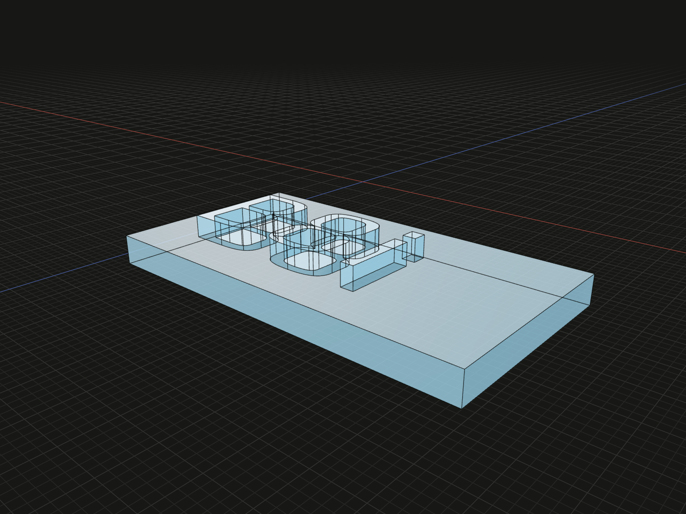

Shape a loaded font into connected planar faces for solid lettering and engraving.

## Example

```ts
import {googleFont, text, originCenter, extrude, group} from '@code3d/core';

const sans = await googleFont('Play');
const outlines = text('Code3D', sans, 10, {letterSpacing: 0.3, kerning: true});
export const lettering = group(extrude(originCenter(outlines), 2));
```



Complete example: [text example](../../../app/examples/text.ts).

## Signature

```ts
function text(
  content: string,
  font: Font,
  size: number,
  options?: TextOptions,
): readonly FaceModel[];
type TextOptions = Readonly<{
  letterSpacing?: number;
  kerning?: boolean;
}>;
```

Import the functions and named types from `@code3d/core`.

## Content, font and size

All first three arguments are required. `content` is one string without newline,
carriage return or tab. `font` must be the actual value returned by [font](font.md)
or [googleFont](google-font.md); await loading before calling this synchronous
function. `size` is a positive finite em size in model units, not the capital-letter
height, visible bounds height or pixels.

HarfBuzz shapes glyph outlines, advances, kerning and supported ligatures.
Quadratic and cubic outlines remain curves. Overlapping contours within a glyph
use the non-zero fill rule. Missing characters throw with the character and Unicode
code point rather than silently selecting another family. Use a font or Google
Font selection containing all required characters.

## Options

| Field           | Default | Meaning                                                                                     |
| --------------- | ------- | ------------------------------------------------------------------------------------------- |
| `letterSpacing` | `0`     | Extra finite model-unit distance between laid-out glyphs, including spaces; may be negative |
| `kerning`       | `true`  | Apply the font's pair adjustments; `false` disables them                                    |

Extra spacing is applied after kerning. It remains the same absolute distance
when size changes. Disconnected parts of one glyph move together, and a ligature
is one glyph for spacing. These controls do not automatically merge overlapping
letters into one face or solid.

## Faces and coordinates

The return is an ordinary readonly array of connected `FaceModel` regions,
not one element per character. A typical B has one face with two holes; a typical
i has two faces. Empty text and space-only strings produce `[]`; spaces still
advance subsequent visible characters. Unsupported colored glyph rendering,
font collections and full bidirectional/multiscript paragraph layout are outside
this API. Build multiple positioned calls for multiple lines.

Every face lies initially on XZ: +X goes right, -Z goes up and +Y is the normal.
All faces share the baseline origin `[0, 0, 0]`; they are not individually
centered. The array preserves the layout needed by [extrude](extrude.md),
[group](group.md), [union](union.md) and [cut](cut.md).

The example centers the whole array with [originCenter](origin-center.md), keeping
letter spacing and holes, then extrudes 2 units. Centering each face separately
would lose the intended layout. Positive extrusion raises lettering along +Y;
negative extrusion can make cutting tools for engraving. Use [wrap](wrap.md) and
[thicken](thicken.md) for lettering on a curved face.

## Lifetime and failures

Loaded fonts are immutable resources; text generation and subsequent modeling
are synchronous. Invalid size, nonfinite spacing, missing glyphs or unsupported
control characters fail before a usable layout is returned. Complex outlines can
still encounter kernel modeling limits. Text faces are model values; editing the
content creates new geometry on the next evaluation. They are not editable
sketch entities. See the [text workflow](../text.md) for raised and engraved examples.
