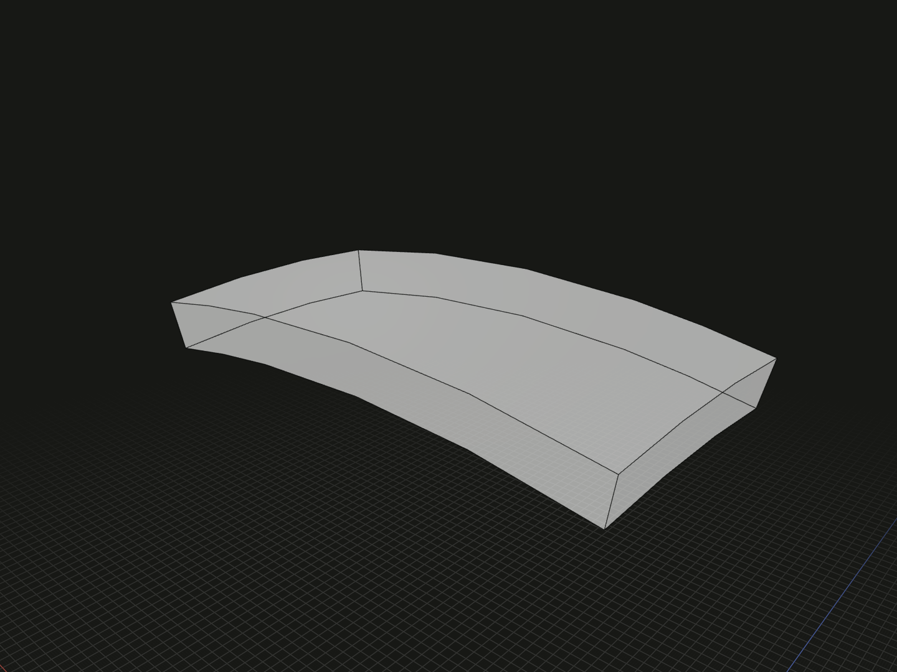

Offset a face along its surface normals and close the boundary walls to produce a solid. Use signed thickness for raised material or inward cutting tools on curved surfaces.

## Example

```ts
import {rectangle, sphere, thicken, wrap} from '@code3d/core';

const ball = sphere(20);
const label = rectangle(8, 4).originOffset(0, -24, 0);
const curvedFaces = wrap(label, ball.surface(1));
export const curvedPlates = thicken(curvedFaces, 0.8);
```



Complete example: [shape construction](../../../app/examples/operations/shape-construction.ts).

## Signature

```ts
function thicken(face: FaceModel<{}>, thickness: number): SolidModel;
function thicken(
  faces: readonly FaceModel<{}>[],
  thickness: number,
): readonly SolidModel[];
// Equivalent method on one face:
face.thicken(thickness);
```

Import the functions and named types from `@code3d/core`.

## Parameters and output

| Parameter        | Meaning                                                             |
| ---------------- | ------------------------------------------------------------------- |
| `face` / `faces` | One planar or curved face model, or a readonly array of face models |
| `thickness`      | Required finite, non-zero signed distance in model units            |

Positive thickness follows the oriented face normal; negative thickness follows
its opposite. For faces wrapped onto an ordinary outward-facing solid surface,
positive thickness creates material outside it. Use those solids with
[union](../api.md#composition-and-boolean-operations) for relief; use negative
thickness with [cut](../api.md#composition-and-boolean-operations) for engraving.
Thickening alone does not fuse a result into or remove material from the target.

The original face, its offset and boundary walls form the solid. Holes remain
part of the trimmed domain. Each result preserves the corresponding input frame
and placement. Arrays preserve order, are processed independently and are not
fused; an empty array returns `[]`. A single face returns one `SolidModel`.

## Curvature and validation

Non-face inputs and zero, nonfinite or nonnumeric thicknesses are rejected.
Offsets can fail at tight curvature, intersecting walls or invalid boundaries.
Curvature-centre crossings detected by offset validation are rejected. The
trimmed face, including its holes, is checked with private tessellation and
adaptive refinement; checks do not simply sample the UV bounding rectangle.

Keep features and thickness modest relative to local curvature. Numerical checks
do not prove the absence of every global self-intersection on arbitrary freeform
surfaces; the final kernel shape must also form a valid positive-volume solid.
Reduce thickness if the offset cannot be constructed.

## Editing and references

Incomplete calls use thickness 1 for an omitted or `undefined` argument; TypeScript
still requires it. The App can inspect the input faces and produced solids and
edit the thickness. Existing models and their references remain unchanged.

The solid supports measurements, topology and further modeling operations; see
[model values](../values.md) and [local coordinates](../local-coordinates.md).

## Related APIs

- [wrap](wrap.md) creates curved faces from a planar layout.
- [extrude](extrude.md) extends a planar face along one fixed normal direction.
- [Solid modifications](../api.md#model-operations) includes hollowing an existing solid with `.shell()`.
