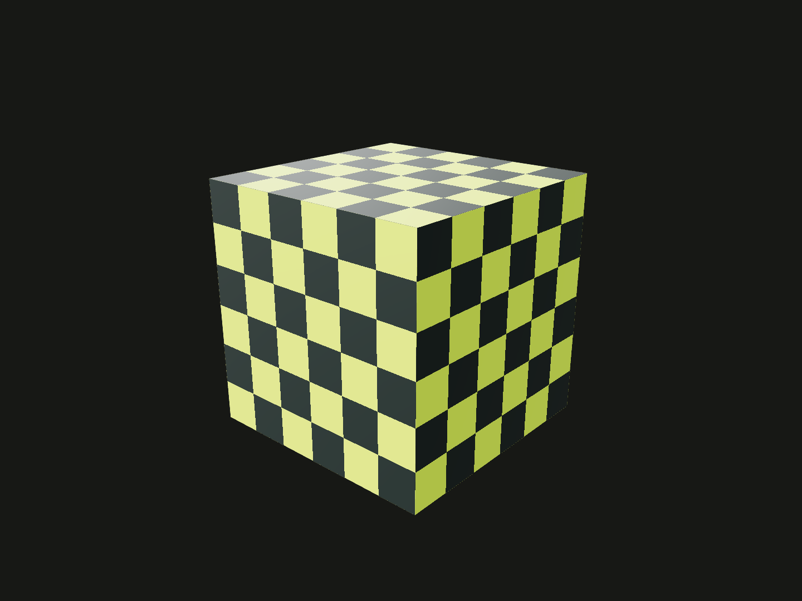

Use Core’s Three.js dependency for serializable materials and loaded textures.

## Example

```ts
import {box, sphere} from '@code3d/core';
import * as THREE from '@code3d/core/three';

// A plain color is enough for most models.
export const plain = box(16, 16, 16).material('#8ed5d1');

// Use a native material when you need control over its surface properties.
export const lacquered = sphere(9).material(makeLacquer());

// A texture uses the model's native UV coordinates.
export const textured = box(16, 16, 16).material(makeCheckerMaterial());

// Select an exported name, then switch to Render to inspect its appearance.
function makeLacquer() {
  return new THREE.MeshPhysicalMaterial({
    color: '#eb633e',
    roughness: 0.25,
    metalness: 0.1,
    clearcoat: 1,
    clearcoatRoughness: 0.12,
  });
}

function makeCheckerMaterial() {
  const checker = new THREE.DataTexture(
    new Uint8Array([
      216, 255, 62, 255, 35, 48, 45, 255, 35, 48, 45, 255, 216, 255, 62, 255,
    ]),
    2,
    2,
  );
  checker.colorSpace = THREE.SRGBColorSpace;
  checker.magFilter = checker.minFilter = THREE.NearestFilter;
  checker.wrapS = checker.wrapT = THREE.RepeatWrapping;
  checker.repeat.set(3, 3);
  return new THREE.MeshStandardMaterial({map: checker, roughness: 0.65});
}
```



Complete example: [appearance example](../../../app/examples/materials.ts).

## Signature

```ts
import {MeshStandardMaterial, DataTexture} from '@code3d/core/three';
import * as THREE from '@code3d/core/three';
// This entry re-exports the native Three.js classes, functions and types.
// Pass a supported Material instance to model.material(material).
```

Import native Three.js classes and types from `@code3d/core/three`.

## Shared dependency instance

`@code3d/core/three` directly re-exports the Three.js dependency used by Core.
Named and namespace imports work in both App and Node. Use this entry in model
code and reusable modeling packages so native material constructor identity is
shared. Material instances from a separate Three.js installation or custom
subclasses cannot be restored as Core's native type and are rejected.

The entry does not turn Three.js meshes, scenes or vectors into Code3D model
values. It exposes upstream APIs; model geometry still comes from Core constructors
or [custom primitives](../custom-primitives.mdx). Browser-specific upstream APIs
retain their environment requirements. Code3D does not copy the upstream reference;
see [Three.js documentation](https://threejs.org/docs/) for native class options.

## Loaded texture data

The example creates a checker `DataTexture`, sets its color space, filtering and
repeat behavior, and captures it in a `MeshStandardMaterial`. Loaded images,
canvas pixels, ImageBitmap, data textures and cube textures are supported.
A texture must finish loading before [material](material.md) is called.

In the App modeling worker, use `ImageBitmapLoader` when loading ordinary images;
a DOM-dependent image loader is not a substitute for worker-compatible loading.
Loaders and external servers must support the environment and CORS requirements.
A captured model owns a snapshot of pixels, so later edits to the source buffer
or canvas do not animate the assigned model.

Finite face UV coordinates are normalized to 0–1 per face. Configure texture
`repeat`, `offset` and `rotation` for mapping. This is each face's native surface
parameterization, not a custom authored UV unwrap or a global bounding-box map.
The checker example repeats three times per normalized direction.

## Transfer representation

Core captures Three.js `toJSON()` material data and restores it with
`MaterialLoader` in the viewport. The source instance, functions and live resources
do not cross that boundary. See the upstream
[Material](https://threejs.org/docs/pages/Material.html) and
[MaterialLoader](https://threejs.org/docs/pages/MaterialLoader.html) references for their
serialization interfaces; Code3D applies these additional restrictions:

| Feature                 | Supported boundary                                                                                                                 |
| ----------------------- | ---------------------------------------------------------------------------------------------------------------------------------- |
| Native material classes | Must restore to the same constructor from Core's Three.js instance                                                                 |
| Textures                | Loaded image/data/cube pixels; no live video, render target, compressed, 3D/layered data textures or manual mipmaps                |
| Callbacks               | Custom onBeforeCompile, onBeforeRender and customProgramCacheKey are rejected                                                      |
| Local overrides         | clippingPlanes, clipIntersection, clipShadows, shadowSide and precision overrides are rejected when not represented by native JSON |
| Shader uniforms         | Direct supported native values or plain serializable arrays/structs; no nested native objects that JSON cannot restore             |
| Shader extensions       | Uniform groups, index0AttributeName and custom defaultAttributeValues are rejected                                                 |
| userData and payloads   | Must be serializable; functions, symbols and bigint are rejected                                                                   |

Shader material availability in Three.js does not imply arbitrary mutable shader
state can be transported. Construct supported serializable values, and apply the
material again when the intended model appearance changes. This follows Core's
immutable model semantics; it does not observe mutable Three.js fields.

## Related APIs

[material](material.md) explains replacement, group propagation, colors and export
formats. [@code3d/materials](../../../materials/README.md) supplies reusable native
presets. Lower-level tooling exposes material snapshots and color parsing for
host integration; ordinary model code only needs this entry and `material`.
