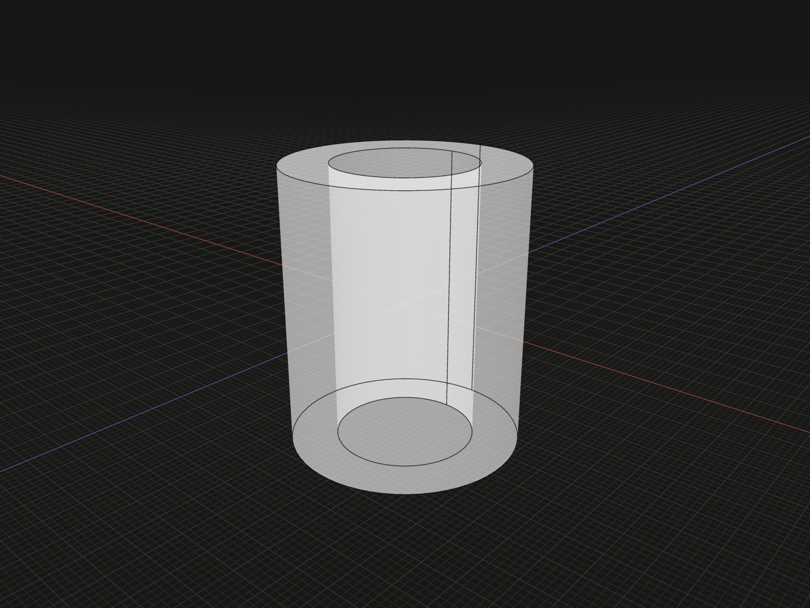

Create a straight circular tube with a constant wall thickness and a through bore. Use it for a sleeve, bushing or hollow spacer.

## Example

```ts
import {tube} from '@code3d/core';

export const hollowTube = tube(5, 3, 12);
```



Select `hollowTube` in the App to inspect this solid. Select a numeric argument
and press Tab to edit it.

Complete example: [basic shapes](../../../app/examples/primitives/primitives.ts).

## Signature

```ts
function tube(outerRadius: number, innerRadius: number, y: number): SolidModel;
```

Import `tube` and, when needed, `type SolidModel` from `@code3d/core`.
The same call works in the App and Node; Node initializes the kernel automatically.

## Parameters

| Parameter     | Meaning                                   | Accepted values                                          |
| ------------- | ----------------------------------------- | -------------------------------------------------------- |
| `outerRadius` | Radius of the outside cylindrical surface | Finite and greater than zero                             |
| `innerRadius` | Radius of the through bore                | Finite, greater than zero and smaller than `outerRadius` |
| `y`           | Full height along local Y                 | Finite and greater than zero                             |

All parameters are required in TypeScript. Lengths use the model's common units;
see [export scale](../../../web/src/content/docs/docs/guides/exporting.md#scale-and-orientation).

## Result and coordinates

Returns a `SolidModel<CanonicalElements>` centered at the local origin with
its axis along +Y. The bore passes through both ends. The result has four
faces: outer and inner cylindrical surfaces, plus two annular end faces.
The annuli cap the wall material without closing the bore.

X and Z span `-outerRadius` to `outerRadius`; Y spans `-y / 2` to `y / 2`.
For the example, the bounds are `[-5, -6, -5]` to `[5, 6, 5]`, the outside
diameter is 10, the bore diameter is 6, and the wall thickness is 2.

The initial `.origin` and `.center` are `[0, 0, 0]`, inside the empty bore.
The `.axis` is the central +Y reference line. Directional bounds describe
the outside envelope; a bound's reference point need not lie in the wall.
Changing `innerRadius` changes the wall and volume without changing the
outer bounding box.

The solid provides frame, origin, center, axis and directional bound references.
It supports Boolean operations, fillets, chamfers, shelling, materials and relations.
Derived operations return new model values; see [model values](../values.md)
and [local coordinates](../local-coordinates.md).

## Measurements

Wall thickness is `outerRadius - innerRadius`.
Volume is `Math.PI * (outerRadius ** 2 - innerRadius ** 2) * y`.
The example's `.volume` is `192 * Math.PI`, approximately `603.185789`.

Total surface area includes the outside, the bore and both annuli:
`2 * Math.PI * (outerRadius + innerRadius) * y + 2 * Math.PI * (outerRadius ** 2 - innerRadius ** 2)`.
Use `.area` to read it from the model.

## Validation and editing defaults

All dimensions must be positive finite numbers. Invalid values report the
parameter name followed by `must be a positive finite number.`.
Equal or inverted radii throw `innerRadius must be smaller than outerRadius.`.
An inner radius of zero is rejected; use [`cylinder`](cylinder.md) for a
solid rod. Numeric strings and `null` are not converted.

This constructor has a constant circular section. For a shaped cavity or a
closed-bottom vessel, use [Booleans](../api.md#composition-and-boolean-operations)
or [shelling](../shells.mdx).

While an incomplete call is being edited, omitted or `undefined` arguments use
`outerRadius = 5`, `innerRadius = 3` and `y = 10`. These runtime defaults let the editor
complete a call; they do not remove the required TypeScript arguments.
The resulting dimensions must still satisfy all constraints.
Very small dimensions or clearances can also encounter the modeling kernel's tolerance.

## Related APIs

- [cylinder](cylinder.md) creates a solid circular rod.
- [frustum](frustum.md) creates a solid circular taper.
- [Shells](../shells.mdx) hollow a more general solid.
- [Solid primitives](../api.md#solid-primitives) compares the available starting shapes.
