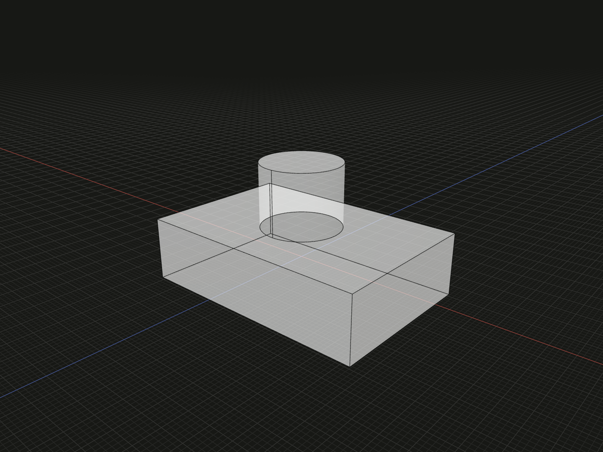

Fuse two or more solid models, including their solved placements.

## Example

```ts
import {box, cylinder, union} from '@code3d/core';

const base = box(30, 8, 20);
const boss = cylinder(5, 10).originOffset(0, -7, 0);
export const joined = union([base, boss]);
```



Complete example: [solid operations](../../../app/examples/operations/solid-operations.ts).

## Signature

```ts
function union(operands: readonly SolidModel<{}>[]): SolidModel;

// SolidModel method:
solid.union(operands: SolidModel<{}> | readonly SolidModel<{}>[]): SolidModel;
```

Import the functions and named types from `@code3d/core`.

`base.union(boss)` and `base.union([boss])` are equivalent to
`union([base, boss])`. The method also accepts several additional solids in an
array. Only the method accepts a single solid argument; the free function takes
an array containing the complete operation.

## Operands and result

The free function's `operands` array must contain at least two solid models. Groups, faces, curves and points
are rejected. The result contains the combined volume with shared volume counted
once. For the example, the boss overlaps the base by 2 units and the total volume
is `4800 + 200 * Math.PI`.

The inputs are immutable. Relations between operands are solved together before
geometry is combined. The result retains the first input's local frame,
placement, material and origin; for `cut`, that input is the stock. The result
is a new `SolidModel` with canonical references, not a group with named members.
Use [group](../api.md#composition-and-boolean-operations) to retain separate parts.

Input arrays describe one operation. They do not apply the operation independently
to each element. Topology inherited one-to-one from an input is prefixed by its
one-based operand position, for example `[1, 4]`; split, merged and newly generated
topology receives new IDs. Inspect the result before using its edge or surface IDs
in a later operation. See [topology IDs](../topology.md#ids-belong-to-a-model).

## Connectivity and limits

Separated operands can produce one model containing several disconnected solids.
The return type does not guarantee a connected body: [shell](shell.md) requires
one connected solid. Arrange operands with a genuine shared volume when building
a single body. Coincident, tangent or very small features can make kernel boolean
operations fail; adjust the placement or dimensions when construction fails.

The method requires at least one additional solid; an empty array throws.
Its receiver is the first operand, so its local frame, material and metadata
belong to the result. Selecting the receiver or operands in the App previews
their solved composition while preserving the focused input.
For material removal use [cut](cut.md), or retain only the shared volume with
[intersect](intersect.md).
