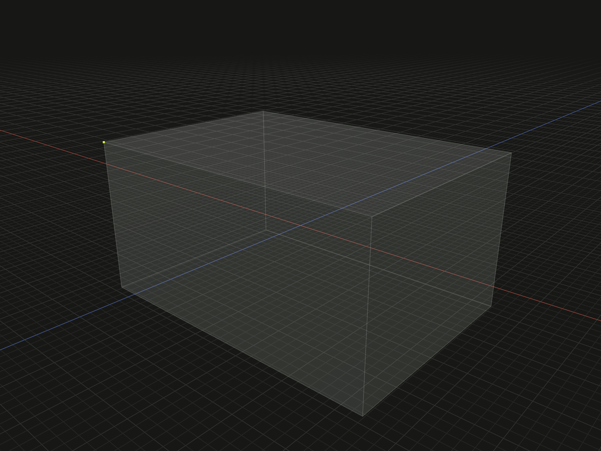

Select point references to existing topology vertices.

## Example

```ts
import {box} from '@code3d/core';

export const bodyV = box(20, 10, 14);
export const corner = bodyV.vertex(3);
export const chosenCorners = bodyV.vertices([3, 1]);
```



Complete example: [topology and references](../../../app/examples/operations/topology-api.ts).

## Signature

```ts
receiver.vertex(id: VertexId): Vertex;
receiver.vertices(ids?: readonly VertexId[]): readonly Vertex[];
```

Import the functions and named types from `@code3d/core`.

## Receivers and result

Geometric models of every kind provide vertex selection. `Solid`, `Surface`,
`Edge` and `Vertex` references also expose their contained vertices. A group has
no aggregate vertex IDs; select a member's topology through [expose](expose.md)
or its actual instance reference.

The single method returns a `Vertex`; the plural method returns a readonly array.
Neither creates a point model or modifies the body. The example selects the box's
V3 and then the ordered pair V3, V1. Use a selected vertex in [align](align.md),
[originPoint](origin-point.md), [pivotPoint](pivot-point.md) or distance queries.

## Vertex properties

`kind` is the literal `vertex`; `id` is its `VertexId`. A vertex is a `PointAnchor`
and also provides `center`, six directional bounds and vertex selection.
Its center coincides with the vertex position. It has no ordinary public x/y/z
fields, modeling transforms or independent geometry lifetime. Keep the owning
model alive when using it. To create standalone point geometry from coordinates,
use [point](point.md).

## IDs and selection order

IDs belong to the original geometry's topology namespace, not to an array index
or the entire application. A valid ID is a positive integer or a readonly path
of at least two positive integers. `[1, 4]` as a plural selection requests two
IDs; `[[1, 4]]` requests one inherited path. Display labels such as `E2` or
`S[1,4]` are not accepted as string IDs.

Omitting the plural argument returns all available elements in topology order.
An explicit ID array preserves authored order and duplicates. An empty array
returns `[]`. Malformed, unknown or retired IDs throw. Selecting through a child
reference also checks membership: an ID elsewhere on the body cannot be selected
through an unrelated surface or edge.

Child queries retain the original namespace rather than renumbering from one.
Booleans and other construction operations may prefix inherited IDs with their
input position; local edits preserve surviving IDs and retire replaced ones.
Use the current result's topology after an edit. See
[topology lineage](../topology.md#ids-belong-to-a-model).
