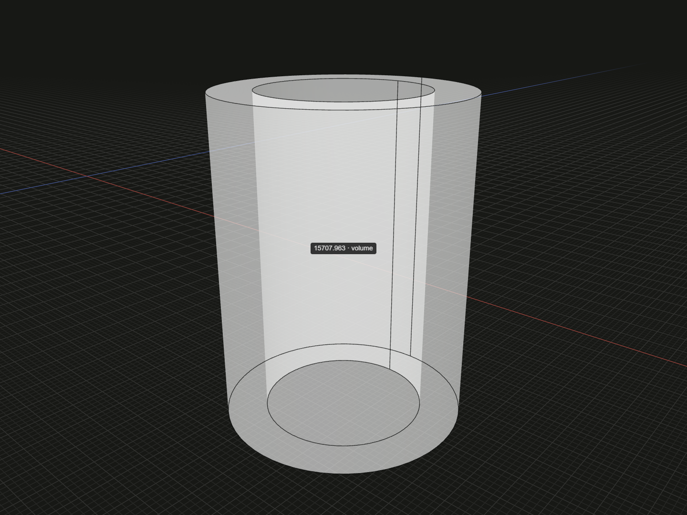

Read the volume occupied by solid material, excluding holes and cavities.

## Example

```ts
import {box, group, tube} from '@code3d/core';

const block = box(20, 30, 10);
const pipe = tube(15, 10, 40).originOffset(-60, 0, 0);

// Select .volume to inspect the solid and the space occupied by its material.
const blockVolume = block.volume; // 6000
const pipeVolume = pipe.volume; // 5000 * Math.PI; the bore is excluded.
const enlargedVolume = block.scaled(2).volume; // 48000

export default group([block, pipe]);
```



Complete example: [measurement example](../../../app/examples/operations/volume.ts).

## Signature

```ts
solidModel.volume: number;
solidReference.volume: number;
```

Import the functions and named types from `@code3d/core`.

## Receivers and units

`SolidModel` and an exposed `Solid` reference provide readonly `volume` in cubic
model units. It measures material occupancy. Through-holes, bores and enclosed
cavities are excluded. The example's block has volume 6000; the tube has volume
`5000 * Math.PI`, and scaling the block by 2 produces 48000.

Faces, edges, vertices, infinite anchors and groups do not have this property.
Summing group-member volumes counts overlapping parts separately. Use
[union](union.md) first when measuring the fused occupied region is intended.

## Transforms and measurement lifetime

Rotations, origin edits and placement preserve volume. Positive uniform
[scaled](scaled.md) multiplies volume by the cube of the scale factor. An exposed
solid reference includes the scale of its selected geometry.

This getter returns an ordinary number computed now. Creating a cut, shell or
other new model later does not update an old numeric result. Read the property
from the result you intend to measure. Kernel integration uses floating-point
arithmetic, so comparisons should allow a suitable tolerance.

## Inspection

Select `.volume` in App to show the solid and its volume label at the volume
centroid. The display uses the recorded result and does not create an editable
dimension. Use [area](area.md) for total boundary surface and [bounds](bounds.md)
for axis-aligned extents; their product is generally not the material volume.
