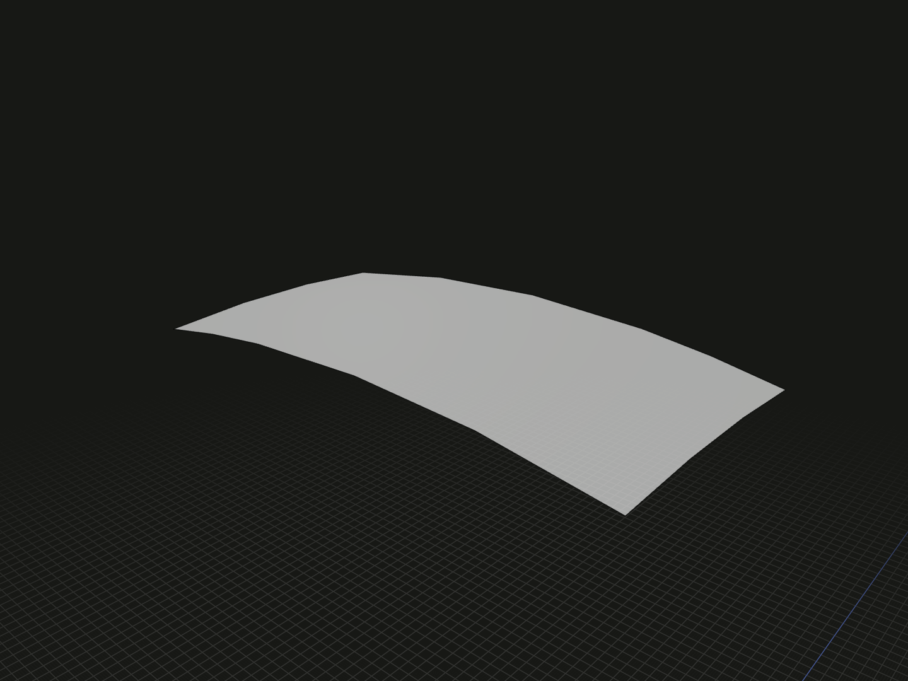

Map a planar face or coplanar face array onto one finite curved surface. The shared layout selects one local mapping; output remains a face array because periodic seams can split a region.

## Example

```ts
import {rectangle, sphere, wrap} from '@code3d/core';

const ball = sphere(20);
const label = rectangle(8, 4).originOffset(0, -24, 0);
export const curvedFaces = wrap(label, ball.surface(1));
```



Complete example: [shape construction](../../../app/examples/operations/shape-construction.ts).

## Signature

```ts
function wrap(
  profiles: FaceModel<{}> | readonly FaceModel<{}>[],
  target: Surface | FaceModel<{}>,
  options?: WrapOptions,
): readonly FaceModel<{}>[];
interface WrapOptions {
  tolerance?: number;
}
```

Import the functions and named types from `@code3d/core`.

## Inputs and localization

`profiles` must be planar faces in a shared plane after placement. `target` is
one finite topological surface or face model, not an infinite `.plane` reference
or an entire solid. Select a solid surface explicitly, as in `ball.surface(1)`.
Use `.surfaces()` to inspect choices; IDs are specific to the source geometry.

`options.tolerance` is a positive finite length in model units, default `0.001`.
It controls numerical mapping, layout checks and boundary fitting, not text size
or a surface UV scale. Empty profile arrays return `[]`.

The complete profiles' **shared planar bounding rectangle** chooses the target
region, including holes and blank spaces between profiles. Position the layout
outside the target; [originCenter](../api.md#origins-and-rotation) on a face array
centers it as a whole. The closest target point corresponds to its normal
projection onto the source plane. The mapping rotates source directions into
the tangent plane by the smallest rotation, then follows surface geodesics.
All input faces share this mapping.

Cylinder wrapping preserves developed lengths. A sphere or other surface with
double curvature generally distorts other distances and areas. This is a local
mapping, not distortion-free wrapping over an entire surface.

## Support and failure conditions

- Multiple closest points are accepted when their local maps agree within tolerance;
  distinct maps raise an error instead of being averaged.
- The source region may touch the target but must not span both sides of it.
  Target geometry outside the rectangle's normal projection does not participate
  in localization or crossing checks.
- The entire mapped rectangle must fit the selected trimmed face, including its
  holes. Crossing to another topological face is unsupported; periodic seams
  within the selected face are supported.
- Smooth analytic and B-spline surfaces are supported. Singular parameterizations,
  perpendicular source planes, folds, full periodic overlaps and failed boundary
  fits raise errors. Reduce or reposition the layout to obtain a regular mapping.
- Adaptive checks refine numerical interpolation and short spline knot spans.
  Failure to converge or an exhausted validation budget is an error, not acceptance.

## Result and subsequent operations

The result is `readonly FaceModel<{}>[]` in the first profile's frame and placement.
These are true curved faces with no named `plane` member. Input models are unchanged;
replacing a named reference using `expose` does not redefine the geometric source
plane. No `face.wrap()` method is provided.

Use [thicken](thicken.md) to give results signed thickness. [extrude](extrude.md),
[revolve](revolve.md) and [sweep](sweep.md) require planar profiles and cannot consume
these curved faces directly. Numerical regularity checks do not prove global
injectivity for every arbitrary freeform surface.

See the [cylinder, sphere and B-spline lettering example](../../../app/examples/operations/wrap.ts)
for complete raised and engraved models. In the App, inspect either the profiles
or the target argument to view its role in the mapping.
