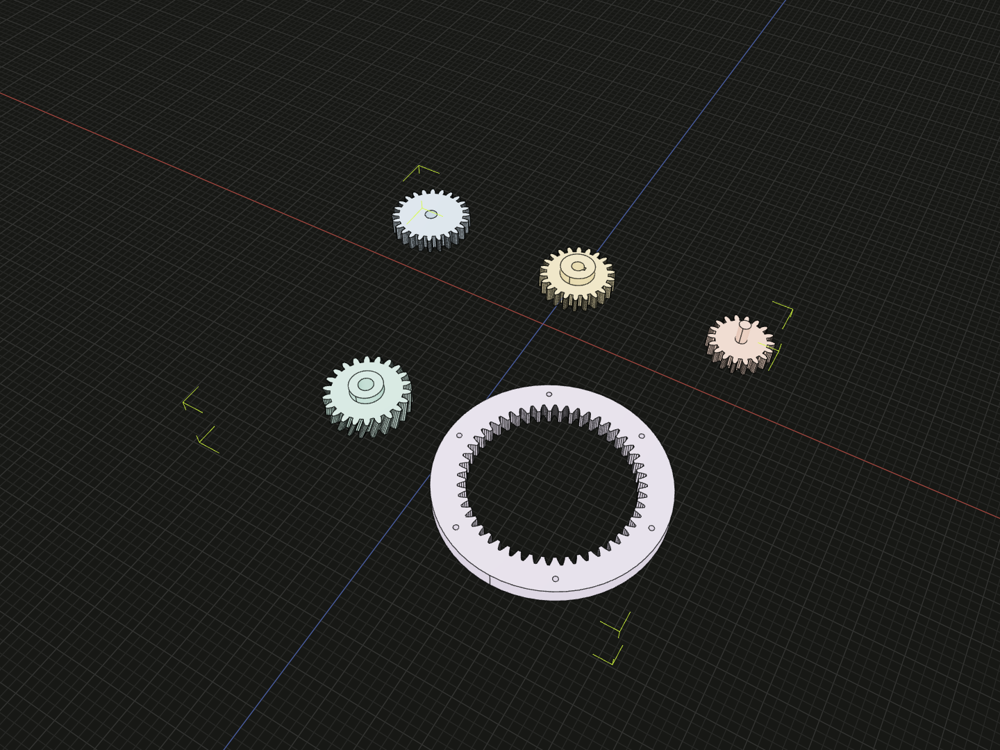

# @code3d/gears

Build complete nominal spur, helical and internal cylindrical gear solids from
tooth dimensions and mounting parameters. Results are regular Code3D solids
with named gear-axis and face references.

## Installation

```sh
npm install @code3d/core @code3d/gears
```

The App includes Gears with its built-in Core. Install both packages when
using Node or a project with its own Core installation.

## Example

Build a spur gear with a keyed bore and a projecting hub.

```ts
import {spurGear} from '@code3d/gears';

export const wheel = spurGear({
  module: 2,
  teeth: 22,
  faceWidth: 10,
  mounting: {
    kind: 'bore',
    diameter: 8,
    keyway: {width: 2.4, depth: 1.2},
    hub: {diameter: 22, length: 6, side: 'up'},
  },
}).material('#d3b46c');
```



The gold wheel in the back row matches this example: 22 teeth, an 8 mm bore,
a 2.4 mm keyway and a 22 mm hub.
The gallery also includes a plain bore, an integral shaft, a helical gear and
an internal ring.

Complete example: [gears and mounting options](../app/examples/packages/gears.ts).

## Usage notes

- Dimensions are in millimetres and angles are in degrees.
- Results are solids with named axis and face references for placement.
- Geometry is intended for nominal layout and visualization. Flanks use sampled
  involute chords and simplified root transitions, not production tooth surfaces.
- A pair of generated gears is not a validated gear pair. Tolerances, load
  capacity and interference-free meshing require separate checks.

## Documentation

- [Gear API](docs/api.md): constructors, dimensions, mounting and named references.
- [Standards and scope](docs/api.md#standards-and-scope): nominal profiles, validation and modeling limits.

## Source and development

- [Public API](src/library/index.ts): gear constructors and options.
- [Tooth geometry](src/library/tooth-solid.ts): nominal tooth construction.
- [Geometry tests](test/gears.test.ts): tooth dimensions, mounting and validation.
- [Development guide](../../.agents/docs/development.md): repository setup and test commands.
