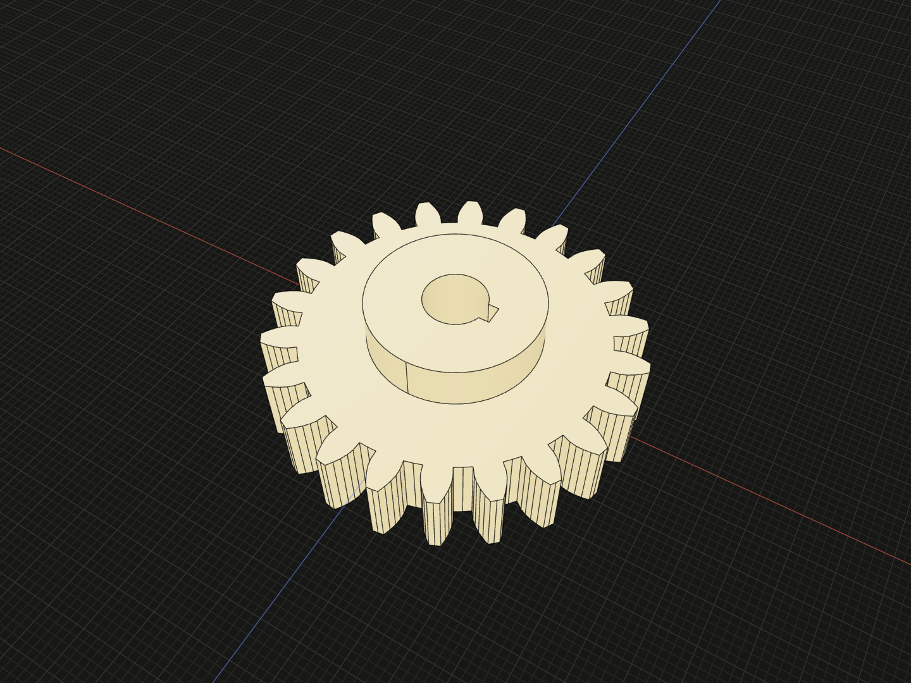
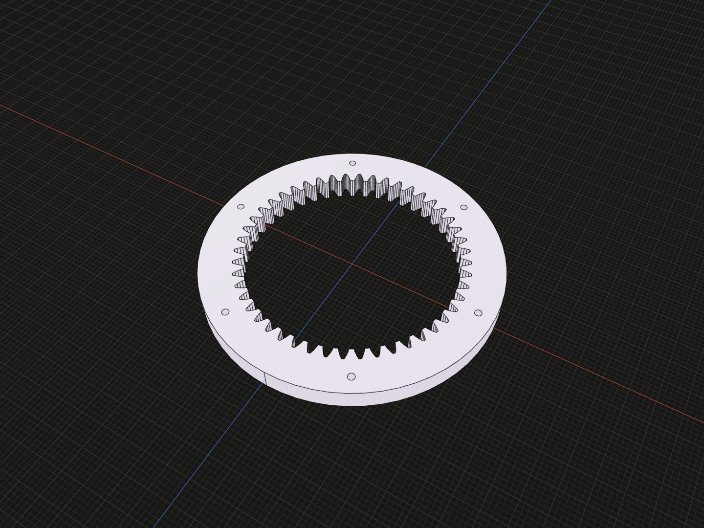
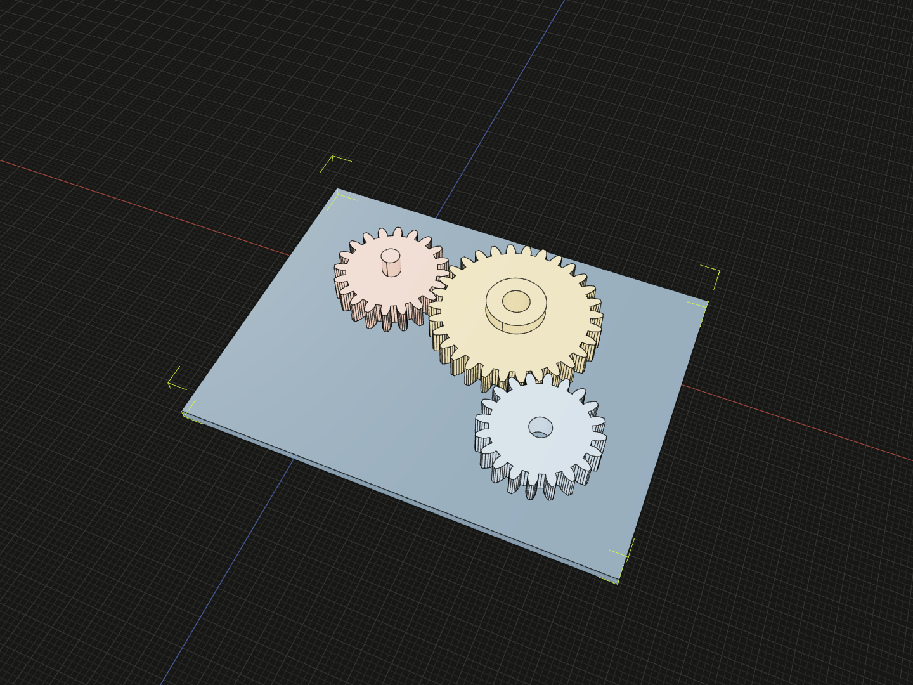

Choose a gear constructor, define its mounting features, and use named
references to place the result. These models describe nominal geometry for
layout and visualization.

## Choose a part constructor

`spurGear(options)` makes an external straight-tooth gear.
`helicalGear(options)` makes an external helical gear from a **normal** module,
helix angle and hand. `internalGear(options)` makes an internal straight-tooth
ring gear. All three return one Code3D `Gear` solid that supports `material()`,
`relate()`, Boolean operations and the usual model methods.

## External gear mounting

Omitting `mounting` gives a solid wheel. Specify a discriminated mounting
choice to make a complete part:

```ts
import {spurGear, helicalGear} from '@code3d/gears';

const keyedHub = spurGear({
  module: 2,
  teeth: 22,
  faceWidth: 10,
  mounting: {
    kind: 'bore',
    diameter: 8,
    keyway: {width: 2.4, depth: 1.2},
    hub: {diameter: 22, length: 6, side: 'up'},
  },
});

const shaftPinion = helicalGear({
  normalModule: 2,
  teeth: 22,
  faceWidth: 12,
  helixAngle: 20,
  hand: 'right',
  mounting: {kind: 'shaft', diameter: 8, upExtension: 14, downExtension: 20},
});
```



The keyed hub has an 8 mm through bore and a 2.4 mm keyway.

Complete example: [gears and mounting options](../../app/examples/packages/gears/parts.ts).

`kind: 'solid'` is the explicit solid choice. A `bore` is through all axial
features. Its optional rectangular `keyway` runs along the whole bore; `depth`
is the radial distance from the bore radius to the slot's outer wall. An
optional `hub` projects by `length` from the selected `up` or `down` gear face.
A `shaft` is integral with the wheel and can extend by different lengths from
both gear faces. The builder checks that bores, keyways, hubs and shafts fit
inside the tooth root circle.

## Internal ring and bolt circle

Create inward-facing teeth in an annular blank, with optional mounting holes.

```ts
import {internalGear} from '@code3d/gears';

const ring = internalGear({
  module: 2,
  teeth: 48,
  faceWidth: 10,
  outerDiameter: 130,
  boltPattern: {count: 6, circleDiameter: 116, holeDiameter: 3},
});
```



The ring has 48 teeth and six 3 mm holes on a 116 mm bolt circle.

Complete example: [gears and mounting options](../../app/examples/packages/gears/parts.ts).

The interior tooth space passes through the ring. `outerDiameter` defines the
annular blank; optional equally spaced through-holes use the given bolt-circle
diameter. The builder requires every hole to lie within the rim beyond the
internal tooth root circle.

## Dimensions and references

| Common field         | Meaning                                                                          |
| -------------------- | -------------------------------------------------------------------------------- |
| `teeth`              | Integer count; at least 18 for external or 35 for internal unshifted teeth.      |
| `faceWidth`          | Axial tooth width in millimetres.                                                |
| `module`             | Transverse module for spur/internal teeth; equal to normal module at zero helix. |
| `normalModule`       | Helical normal module, converted to transverse module using the helix angle.     |
| `helixAngle`, `hand` | Helical angle in degrees and `'right'` or `'left'`.                              |
| `standards`          | Optional basic-rack reference and normal-module-series validation.               |

The shaft axis is local **+Y**. The tooth face spans `-faceWidth/2` to
`+faceWidth/2`; the origin is at the axis and tooth-width midplane. The result
exposes `gearAxis`, `gearFaceUp` and `gearFaceDown` for relation placement. These
refer to the toothed body's original faces, including when a hub or shaft
extends past them. The canonical `axis`, `up` and `down` remain available.

## Assemble compatible gears

`nominalCenterDistance(first, second)` returns the parallel-shaft distance
between pitch circles. External pairs use the sum of pitch radii; an internal
ring and external pinion use the difference. The function checks matching
normal module and helix angle. Parallel-shaft external helical pairs must have
opposite hands. Internal-to-internal meshes are unsupported.

`assembleGears(gears, config)` connects each adjacent pair in array order:
`0→1→2…`. It returns related gear values, with the first gear unchanged.
The helper calculates the engagement phase from tooth counts and contact
direction, then couples the models through Core’s
`coupleRotation(source, {ratio, phase})`, using their own axes and tooth-count ratio; no
tooth-phase argument is needed. By
default, the centers form a straight chain along +X. Compose the returned
values with Core's `group()` when the entire train should be one placeable
model:

```ts
import {group} from '@code3d/core';
import {assembleGears, spurGear} from '@code3d/gears';

const pinion = spurGear({module: 2, teeth: 20, faceWidth: 10});
const wheel = spurGear({module: 2, teeth: 24, faceWidth: 10});
const gears = assembleGears([pinion, wheel], {
  centerDistanceDelta: 0.2,
});
export default group(gears);
```



Complete example: [three-gear train](../../app/examples/packages/gears/assembly.ts).

The two-gear snippet has a nominal shaft distance of 44 mm and requests
44.2 mm. In the pictured three-gear example, both adjacent pairs are 50.2 mm
apart and their center lines meet at 120° at the middle gear.
`centerDistanceDelta` is a signed millimetre adjustment, **not** a backlash
specification. `axialOffset` moves a driven gear along +Y, while keeping the
toothed faces overlapping. For external pairs, a positive center-distance
change increases radial separation; for an internal ring and pinion, a negative
change increases radial clearance.

Shared config values apply to each adjacent pair. When pairs need different
settings, `pairs[0]` adjusts gears 0–1, `pairs[1]` adjusts gears 1–2, and so
on. Provide one entry per adjacent pair. `pairs[i].angle` is the turn in degrees
from the preceding center-line's forward extension to the next center line,
in the assembly XZ plane. It defaults to 0°, continuing straight. The first
pair starts from +X. Positive angles turn from +X toward +Z; negative angles
turn the other way.

Successive turns accumulate: `pairs: [{angle: 60}, {angle: 60}]` gives center-line
directions of 60° and 120° from +X. A 60° turn at a middle gear leaves a 120°
included angle between its neighboring centers. Any finite angle is accepted,
with full turns repeating the same layout. The gear's tooth rotation is
calculated automatically:

```ts
import {box, group} from '@code3d/core';
import {assembleGears, spurGear} from '@code3d/gears';

const first = spurGear({module: 2, teeth: 24, faceWidth: 10});
const second = spurGear({module: 2, teeth: 20, faceWidth: 10});
const third = spurGear({module: 2, teeth: 18, faceWidth: 10});
const arranged = assembleGears([first, second, third], {
  centerDistanceDelta: 0.2,
  pairs: [{}, {angle: 60}],
});
const plate = box(160, 4, 120);
const train = group(arranged).relate(self => self.on(plate.up));
export default group([plate, train]);
```

The first pair lies along +X, and `angle: 60` turns the second segment by 60°,
leaving a 120° included angle at the middle gear. The `group(...).relate(...)`
constraint places the complete train on the plate; the gears keep their
relative positions and tooth phases. Inspecting an input
gear in `assembleGears()` highlights its positioned member within the full
train. Selecting the whole input array or the `assembleGears` function name
emphasizes all assembled gears.

Input gears must come from this package's constructors. Only `.material()` and
`.relate()` preserve the nominal tooth parameters used by this helper. Other
operations, including `.originOffset()` and `.scaled()`, return ordinary models
without those parameters. To follow an external
anchor, relate the first gear before calling `assembleGears()`, or relate the
completed `group()` afterward. A later replacement such as
`first = first.relate(...)` does not retarget the already returned gears.

### Drive through connected parts

Attach the first gear to an input shaft or crank with
`pinion.relate(self => self.frame.align(inputCrank.frame))`, then pass that value
to `assembleGears`. Only the external crank needs the input angle. Each adjacent
pair receives a rotation coupling; parts aligned to a returned gear's frame
follow its solved angle. External gears reverse direction, while an internal
ring and pinion turn in the same direction. Angular changes scale by
`sourceTeeth / targetTeeth`.

The [live transmission example](../../app/examples/packages/gears/transmission.ts)
uses a single **Drive angle** slider and 20/30/40 teeth. One input revolution
produces −2/3 revolution at the middle shaft and +1/2 revolution at the output
crank. Drag through zero or several turns; cumulative angles are preserved.
The shaft centers remain fixed as the input rotates.

This subset uses fixed parallel +Y shafts in the assembly solve frame, with
frame alignment, origin coincidence, `on()` and independent Y `rotate()` steps.
Use `group()` to place or tilt the completed mechanism. Closed driving cycles,
moving carriers and angles driven by arbitrary geometric alignments are not
supported; conflicting angular drivers report an error. Models keep Core's
value semantics: replacing a variable with a new related value does not retarget
references already captured by an assembly.

The engagement phase uses the profiles at their common face midplane. This is
nominal kinematic transmission, without tooth-contact simulation, manufacturing
clearance validation or load-capacity analysis.

## Standards and scope

`standards.toothProfile` accepts `'ISO53'` or `'GBT1356'`. Both select the
equivalent nominal 20° basic-rack profile used by this library. The default is
the same nominal profile. `standards.moduleSeries` accepts `'ISO54'` or
`'GBT1357'`; when supplied, it checks the normal module against either series
of the standard, including the less preferred second series. Without this
option, any positive normal module is accepted. [ISO 53](https://www.iso.org/standard/22643.html)
defines the standard basic rack and [ISO 54](https://www.iso.org/standard/22644.html)
defines normal module values. GB/T 1356 and GB/T 1357 adopt those two ISO
standards respectively.

The modeled flanks use short involute chords, with a straight root transition
and a polygonal tip/root arc. Standard basic-rack references guide nominal
tooth dimensions; this is not a cutter-generated root fillet or a production
inspection surface. Internal gears need gear-pair interference checks, and
the modeled tooth count limit only rules out the smallest unshifted cases.
Manufacturing tolerances, keyway fit classes, material, heat treatment,
strength, backlash and pair motion are outside these constructors. In
particular, selecting a standard here does not assert conformance with
[ISO 1328-1 tooth-flank tolerance classes](https://www.iso.org/standard/45309.html).
