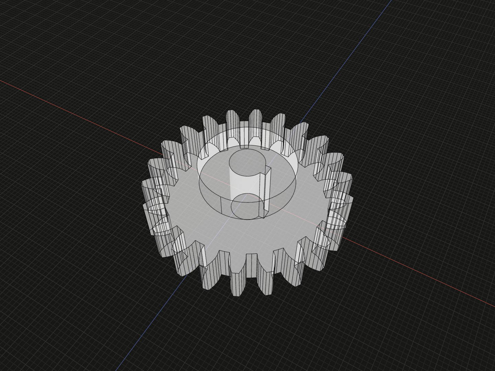
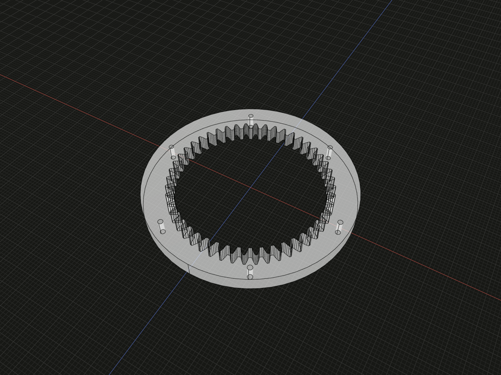

Choose a gear constructor, define its mounting features, and use named
references to place the result. These models describe nominal geometry for
layout and visualization.

## Choose a part constructor

`spurGear(options)` makes an external straight-tooth gear.
`helicalGear(options)` makes an external helical gear from a **normal** module,
helix angle and hand. `internalGear(options)` makes an internal straight-tooth
ring gear. All three return one Code3D `Gear` solid that supports `material()`,
`relate()`, Boolean operations and the usual model methods.

## External gear mounting

Omitting `mounting` gives a solid wheel. Specify a discriminated mounting
choice to make a complete part:

```ts
import {spurGear, helicalGear} from '@code3d/gears';

const keyedHub = spurGear({
  module: 2,
  teeth: 22,
  faceWidth: 10,
  mounting: {
    kind: 'bore',
    diameter: 8,
    keyway: {width: 2.4, depth: 1.2},
    hub: {diameter: 22, length: 6, side: 'up'},
  },
});

const shaftPinion = helicalGear({
  normalModule: 2,
  teeth: 22,
  faceWidth: 12,
  helixAngle: 20,
  hand: 'right',
  mounting: {kind: 'shaft', diameter: 8, upExtension: 14, downExtension: 20},
});
```



The keyed hub has an 8 mm through bore and a 2.4 mm keyway.

Complete example: [gear studies](../../app/examples/gear-studies.ts).

`kind: 'solid'` is the explicit solid choice. A `bore` is through all axial
features. Its optional rectangular `keyway` runs along the whole bore; `depth`
is the radial distance from the bore radius to the slot's outer wall. An
optional `hub` projects by `length` from the selected `up` or `down` gear face.
A `shaft` is integral with the wheel and can extend by different lengths from
both gear faces. The builder checks that bores, keyways, hubs and shafts fit
inside the tooth root circle.

## Internal ring and bolt circle

Create inward-facing teeth in an annular blank, with optional mounting holes.

```ts
import {internalGear} from '@code3d/gears';

const ring = internalGear({
  module: 2,
  teeth: 48,
  faceWidth: 10,
  outerDiameter: 130,
  boltPattern: {count: 6, circleDiameter: 116, holeDiameter: 3},
});
```



The ring has 48 teeth and six 3 mm holes on a 116 mm bolt circle.

Complete example: [gear studies](../../app/examples/gear-studies.ts).

The interior tooth space passes through the ring. `outerDiameter` defines the
annular blank; optional equally spaced through-holes use the given bolt-circle
diameter. The builder requires every hole to lie within the rim beyond the
internal tooth root circle.

## Dimensions and references

| Common field         | Meaning                                                                          |
| -------------------- | -------------------------------------------------------------------------------- |
| `teeth`              | Integer count; at least 18 for external or 35 for internal unshifted teeth.      |
| `faceWidth`          | Axial tooth width in millimetres.                                                |
| `module`             | Transverse module for spur/internal teeth; equal to normal module at zero helix. |
| `normalModule`       | Helical normal module, converted to transverse module using the helix angle.     |
| `helixAngle`, `hand` | Helical angle in degrees and `'right'` or `'left'`.                              |
| `standards`          | Optional basic-rack reference and normal-module-series validation.               |

The shaft axis is local **+Y**. The tooth face spans `-faceWidth/2` to
`+faceWidth/2`; the origin is at the axis and tooth-width midplane. The result
exposes `gearAxis`, `gearFaceUp` and `gearFaceDown` for relation placement. These
refer to the toothed body's original faces, including when a hub or shaft
extends past them. The canonical `axis`, `up` and `down` remain available.

## Standards and scope

`standards.toothProfile` accepts `'ISO53'` or `'GBT1356'`. Both select the
equivalent nominal 20° basic-rack profile used by this library. The default is
the same nominal profile. `standards.moduleSeries` accepts `'ISO54'` or
`'GBT1357'`; when supplied, it checks the normal module against either series
of the standard, including the less preferred second series. Without this
option, any positive normal module is accepted. [ISO 53](https://www.iso.org/standard/22643.html)
defines the standard basic rack and [ISO 54](https://www.iso.org/standard/22644.html)
defines normal module values. GB/T 1356 and GB/T 1357 adopt those two ISO
standards respectively.

The modeled flanks use short involute chords, with a straight root transition
and a polygonal tip/root arc. Standard basic-rack references guide nominal
tooth dimensions; this is not a cutter-generated root fillet or a production
inspection surface. Internal gears need gear-pair interference checks, and
the modeled tooth count limit only rules out the smallest unshifted cases.
Manufacturing tolerances, keyway fit classes, material, heat treatment,
strength, backlash and pair motion are outside these constructors. In
particular, selecting a standard here does not assert conformance with
[ISO 1328-1 tooth-flank tolerance classes](https://www.iso.org/standard/45309.html).
