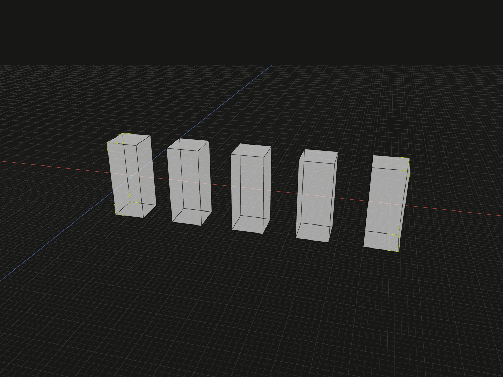

# @code3d/layout

Arrange fixed-size model values with Flex, Grid, precise linear steps and radial
patterns. Fill a target's bounds with as many copies as fit using the same layout
rules.

## Installation

```sh
npm install @code3d/core @code3d/layout
```

The App includes Layout with its built-in Core. Install both packages when
using Node or a project with its own Core installation.

## Example

Arrange five identical posts along X at a fixed 16 mm pitch.

```ts
import {box, group} from '@code3d/core';
import {linear, repeat} from '@code3d/layout';

const posts = linear(repeat(box(8, 20, 8), 5), {axis: 'x', step: 16});
export default group(posts, 'Linear posts');
```



Each post is 8 mm wide, leaving 8 mm of clear space between neighbors.

Complete example: [linear posts](../app/examples/packages/layout/linear.ts).

## Usage notes

- Dimensions are in millimetres and angles are in degrees.
- Layouts preserve each model's size and return arrays of new model values.
  Use `group` to combine the results.
- Layouts with a target space follow its position and orientation. The space
  is a reference and does not need to appear in the output geometry.
- Filling counts complete copies using bounds; it does not clip models to a
  solid or avoid holes. See the [Layout API](docs/layouts.md).

## Documentation

- [Layout API](docs/layouts.md): quantities, spacing, alignment, filling and coordinates.
- [Examples](docs/examples.mdx): runnable Flex, Grid, linear and radial layouts.

## Source and development

- [Public API](src/library/index.ts): layout constructors and configuration types.
- [Geometry tests](test/layout.test.ts) and [type contract](test/public-api.ts): layout and public API coverage.
- [Development guide](../../.agents/docs/development.md): repository setup and test commands.
