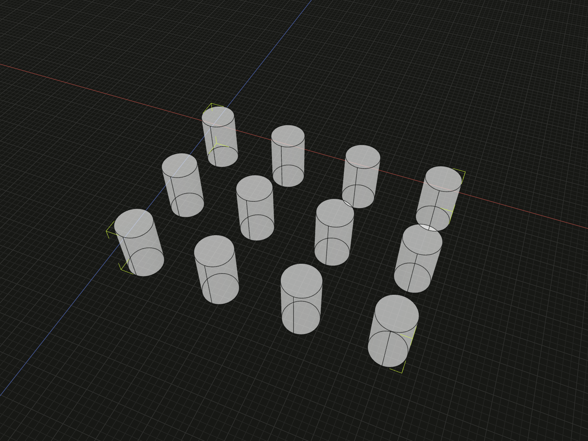
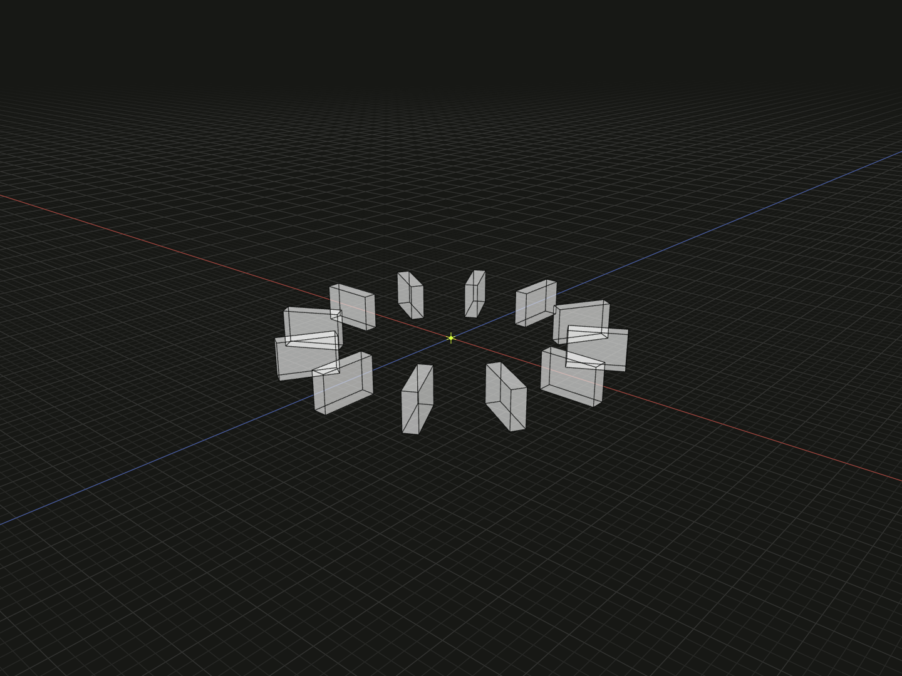

Arrange model collections by spacing, tracks or exact positions. For a first
runnable model, see the [linear layout example](../README.md#example).

## Quantities and inputs

`repeat(model, count)` supplies an explicit number of occurrences of an immutable
model value. It does not move the geometry. Layout functions consume arrays and
produce a new model value for each occurrence, preserving input order and count.
Use an existing array to arrange different parts, or `repeat` for identical parts.

`fillFlex(model, space, config)` and `fillGrid(model, space, config)` calculate
how many complete copies fit before using the corresponding layout. They return
an empty array when no copy fits. Their count is available as `result.length`.
Filling measures the selected axes of the target's bounds; it does not test whether
geometry lies inside an arbitrary solid or avoid holes in that solid.

Models and target spaces are independent arguments. Counts, axes, spacing and
alignment define the layout, so configuration types are `LinearLayoutConfig`,
`RadialLayoutConfig`, `FlexLayoutConfig`, `GridLayoutConfig`,
`FillFlexLayoutConfig` and `FillGridLayoutConfig`. Every layout and fill call requires
its configuration object. Direction is explicit: `axis` for Linear, Radial and
Flex; `axes` for Grid. `step`, `radius` and Grid's `columns` are also required.
Filling requires explicit gaps; write zero when copies should touch.

All outputs are readonly arrays. Layouts preserve model kinds, named references,
materials and topology identities; heterogeneous tuples retain each member's type.
Inputs are unchanged. Counts must be nonnegative safe integers.

## Flex

Flex places fixed-size model bounds consecutively along an axis. Arrange a known
collection with `flex`, or calculate how many copies fit with `fillFlex`:

```ts
flex(items, config);
flex(items, space, config);
fillFlex(model, space, config);
```

For a 100 mm space and 10 mm slats, compare an explicit count with filling:

```ts
// Known quantity: left clearance 5, right flush, gaps 7 for width 100 and slat width 10.
const counted = flex(repeat(slat, 6), space, {
  axis: 'x',
  padding: {start: 5},
  justifyContent: 'space-between',
});

// Calculated quantity: six copies at gap 5, right flush, left clearance 15.
const filled = fillFlex(slat, space, {
  axis: 'x',
  gap: 5,
  padding: {start: 5},
  justifyContent: 'end',
});
```

`axis` is required.
`gap` is the minimum boundary-to-boundary clearance, default zero. With no target,
the interval fits the content and starts at local zero. With a target, it uses
`space.bounds()` along that axis. `padding` can be a number applied to both ends
or `{start, end}`; omitted sides are zero.

`justifyContent` distributes unused width after model widths and minimum gaps:

| Value           | Result                                                                                 |
| --------------- | -------------------------------------------------------------------------------------- |
| `start`         | Begin at the padded minimum; keep gap.                                                 |
| `center`        | Split unused space between both ends; keep gap.                                        |
| `end`           | Finish at the padded maximum; keep gap.                                                |
| `space-between` | Touch both ends; add equal clearance between items.                                    |
| `space-around`  | Give each item equal surrounding space; end spaces are half the internal extra spaces. |
| `space-evenly`  | Give both ends and each internal gap equal extra space.                                |

The default is `start`, for both explicit collections and filling. A singleton
with `space-between` uses start; `space-around` and `space-evenly` center it.
Padding reserves a usable interval; alignment can leave more empty space at an end.

`alignItems: 'start' | 'center' | 'end'` optionally aligns the cross bounds.
`crossAxis` is required when `alignItems` is provided or wrapping is enabled;
it must differ from `axis`. With a target, alignment uses its cross interval. Without a target, that
interval starts at zero and fits the largest cross size. `crossPadding` has the
same form as `padding`. Single-line layouts preserve cross coordinates when
`alignItems` is omitted; the third axis is always preserved.

`wrap: true` requires a target and an explicit `crossAxis`. Items fill each line in input order until the
next one cannot fit, then start the next line along `crossAxis`. Each line uses
its largest cross size, `alignItems` defaults to `start`, and `rowGap` defaults
to `gap`. `justifyContent` applies separately to each line; `alignContent` uses
the same six values to arrange the lines in the padded cross interval. For a
single line with wrapping disabled, `alignContent` and `rowGap` have no effect;
`crossPadding` applies when cross alignment or wrapping is active.

`fillFlex` fills a single line. Both `axis` and `gap` are required; use `gap: 0`
for touching copies. Padding, content alignment and optional item alignment follow
Flex, including the explicit `crossAxis` requirement for `alignItems`.
It does not accept wrapping controls.

## Grid

Grid first sizes column and row tracks, then aligns each model inside its cell.

```ts
grid(items, config);
grid(items, space, config);
fillGrid(model, space, config);
```

For example, arrange twelve pins into four columns:

```ts
import {cylinder, group} from '@code3d/core';
import {grid, repeat} from '@code3d/layout';

const pins = grid(repeat(cylinder(3, 10), 12), {
  columns: 4,
  axes: ['x', 'z'],
  gap: 8,
});
export default group(pins, 'Grid of pins');
```



Each pin has a 6 mm diameter, with an 8 mm clear gap between neighbors.

Complete example: [grid of pins](../../app/examples/packages/layout/grid.ts).

`axes` explicitly names the column and row axes, for example `['x', 'z']`; the
third axis is preserved. Inputs fill columns first, then proceed to the next row.

`columns` is required. `rows` is optional; missing rows are added as auto tracks
until every input has a cell. Each can be a positive number of auto tracks or an
explicit array of `GridTrack` values:

| Track                 | Size                                                         |
| --------------------- | ------------------------------------------------------------ |
| `'auto'`              | Largest model bound in that column or row.                   |
| A number              | Fixed size in millimetres.                                   |
| `{fr: positiveValue}` | A weighted share of available space, respecting model sizes. |

For example, `columns: 3` makes three auto columns; `columns: [20, 'auto', {fr: 2}]`
makes one fixed column, one content-sized column and one fractional column.
Fractional tracks share space left after fixed/auto tracks and gaps, with each
model's size as a lower bound. Without a target, they use the smallest common
fractional unit that accommodates every model. Empty auto tracks have size zero.

`grid` defaults `gap` to zero. `columnGap` and `rowGap` override it for each direction.
These are **track clearances**: smaller models inside cells may have larger actual
clearances. `padding` can be a number for all four sides or, for example,
`{columns: {start: 5, end: 0}, rows: 2}`.

- `justifyContent` / `alignContent`: align the complete columns / rows in the
  target; the same six values as Flex, default `start`.
- `justifyItems` / `alignItems`: align models inside their cells along columns /
  rows; `start`, `center` or `end`, default `start`.

```ts
const parts = grid(repeat(tile, 12), space, {
  axes: ['x', 'z'],
  columns: 4,
  gap: 5,
  justifyContent: 'center',
  alignContent: 'center',
  justifyItems: 'center',
  alignItems: 'center',
});

const filled = fillGrid(tile, space, {
  axes: ['x', 'z'],
  gap: 5,
  padding: 2,
  justifyContent: 'space-between',
  alignContent: 'space-between',
});
```

`fillGrid` requires `axes` and explicit spacing: either a shared `gap`, or both
`columnGap` and `rowGap`. A shared gap may still be overridden per direction.
For touching copies use `gap: 0` (or two explicit zeros).
It determines both track counts from the prototype bounds, padding and gaps. Each resulting cell has the prototype's size; configuration has the same
spacing and alignment fields as Grid, without `columns` or `rows`. Orientation
stays fixed. There is no radial or arbitrary-shape filling mode.

Flex and Grid use CSS's spacing and alignment concepts with fixed-size geometry.
They do not resize models, infer writing directions or parse CSS strings. Models
must fit their explicit cells, and layout sizes must fit any provided target;
otherwise layout reports an error rather than shrinking or dropping inputs.

## Precise steps and circles

Use `linear` for fixed displacements and `radial` for circles or arcs.

### Linear steps

Compose linear layouts for multi-axis arrays with exact pitches:

```ts
const row = group(linear(repeat(pin, 4), {axis: 'x', step: 14}));
const rows = linear(repeat(row, 3), {axis: 'z', step: 14});
```

`linear(items, {axis: 'x', step})` moves input i by `i * step`, preserving the first
input's geometry coordinates. Step is a displacement between copies, not a gap;
it may be negative or zero. With unequal inputs, each retains its own initial
geometry offset before its step is applied.

### Radial patterns

Arrange twelve fins on a circle, rotating each one with the layout:

```ts
import {box, group} from '@code3d/core';
import {radial, repeat} from '@code3d/layout';

const fins = radial(repeat(box(12, 8, 3), 12), {
  radius: 30,
  axis: 'y',
  rotate: true,
});
export default group(fins, 'Radial fins');
```



The fins are equally spaced around a 30 mm radius circle.

Complete example: [radial fins](../../app/examples/packages/layout/radial.ts).

`radial(items, {radius, axis: 'y', startAngle: 0, sweepAngle: 360, rotate: false})`
requires `radius` and `axis`. It places the inputs on a circle or arc about local
zero. Start angle defaults to zero, sweep to 360 degrees and rotation to false.
Y circles start at +X and move toward −Z; X circles start at +Y toward +Z;
Z circles start at +X toward +Y. Sweeps can be positive, negative or zero, within
one full turn. Full circles omit the duplicate endpoint; partial arcs include
both endpoints. A singleton uses `startAngle`.

`rotate: true` rotates each input by its sample angle about the same local axis,
then applies the radial displacement. `false` preserves its supplied orientation.
Apply any additional orientation to the input model itself.

## Coordinates and numerical bounds

Layout measures each model's local `.bounds()` in shared layout coordinates.
Direct model rotations, origin changes and nested assemblies are included;
external relations are not part of these measurements. Layout expresses geometry
at `p + delta` using `originOffset(-delta)` and uses model `rotate` for radial
orientation. A model's local origin remains zero.

With a target `space`, Flex, Grid and both filling tools attach each result's
`frame` to `space.frame`. Axes and bounds are measured in the space's local
coordinates; the results follow its solved position and orientation in the
composition. The space is only a reference dependency: include `...items` with
your other parts without including the construction space itself. Layout does
not recenter each item; its origin corresponds to the space's origin, which can
differ from the space's bounding-box center.

Without a target or external input relations, result origins coincide and
`group(items)` preserves the complete local layout. Existing input relations
remain constraints and must be compatible with the target frame. To repeat an
assembled set of parts, group them first. A group captures its assembly in the
first member's local frame; to place that new group in another assembly, relate
the group itself, for example `self.frame.align(space.frame)`.

Bounds-based tools need finite geometry; empty groups cannot be measured. Empty
collections produce empty results. Gaps, padding and radii must be finite and
nonnegative. Filling needs positive prototype size or positive gap on each fill
axis. Fit calculations allow scale-relative floating-point roundoff only; author
dimensions are not rounded to a fixed decimal precision.
