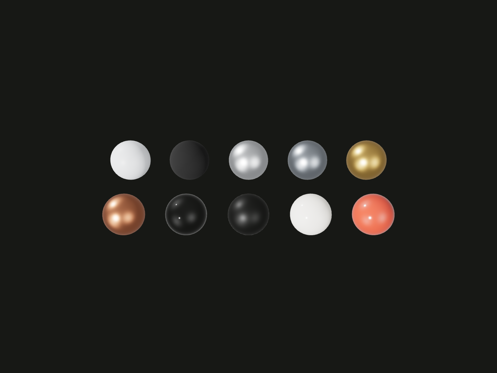

# @code3d/materials

Common material presets for Code3D. Each factory returns a new native Three.js
material from `@code3d/core/three`, ready for a model's `.material()` call.

## Installation

```sh
npm install @code3d/core @code3d/materials
```

The App includes Materials with its built-in Core. Install Core and Materials
when using Node or a project with its own Core installation.

## Example

Compare ten material presets on equal-size spheres under the same lighting.

This example also uses `@code3d/layout` to arrange the spheres in a grid.
For an installed project, add it separately:

```sh
npm install @code3d/layout
```

```ts
import {group, sphere} from '@code3d/core';
import {grid} from '@code3d/layout';
import {
  plastic,
  rubber,
  aluminum,
  steel,
  brass,
  copper,
  glass,
  acrylic,
  ceramic,
  paint,
} from '@code3d/materials';

// Switch to Render to compare equal-size samples under the same lighting.
// Read each row from left to right, starting with the back row.
const finishes = [
  plastic(),
  rubber(),
  aluminum(),
  steel(),
  brass(),
  copper(),
  glass({thickness: 16}),
  acrylic({finish: 'frosted', thickness: 16}),
  ceramic(),
  paint(),
];
const samples = grid(
  finishes.map(finish => sphere(8).material(finish)),
  {
    columns: 5,
    axes: ['x', 'z'],
    gap: 8,
  },
);

const palette = group(samples, 'Material presets');
export default palette;
```



In the App, switch to **Render** to compare the surfaces. Back row, left to
right: plastic, rubber, aluminum, steel, brass. Front row: copper, glass,
frosted acrylic, ceramic, paint.

Complete example: [material palette](../app/examples/packages/material-presets.ts).

## Usage notes

- Each factory accepts a color or an options object. Explicit properties such
  as `roughness` override the selected finish.
- Glass and acrylic use light transmission, not alpha fading. Their `thickness`
  is a rendering parameter, not a measurement of the model; this example uses 16.
- Lighting and reflections affect the result. Presets describe materials;
  they do not configure the scene or load textures.

## Documentation

- [Material presets](docs/presets.md): factories, finish options, transparency and reuse.
- [Screw box assembly](../screws/docs/assembly.mdx): plastic and steel in a complete model.
- [Core material integration](../core/docs/runtime.md#materials-and-entry-points): native materials and shared Three.js imports.

## Source and development

- [Public API](src/library/index.ts): preset factories and options.
- [Material tests](test/materials.test.ts) and [type examples](test/public-api.types.ts): preset and public API coverage.
- [Development guide](../../.agents/docs/development.md): repository setup and test commands.
