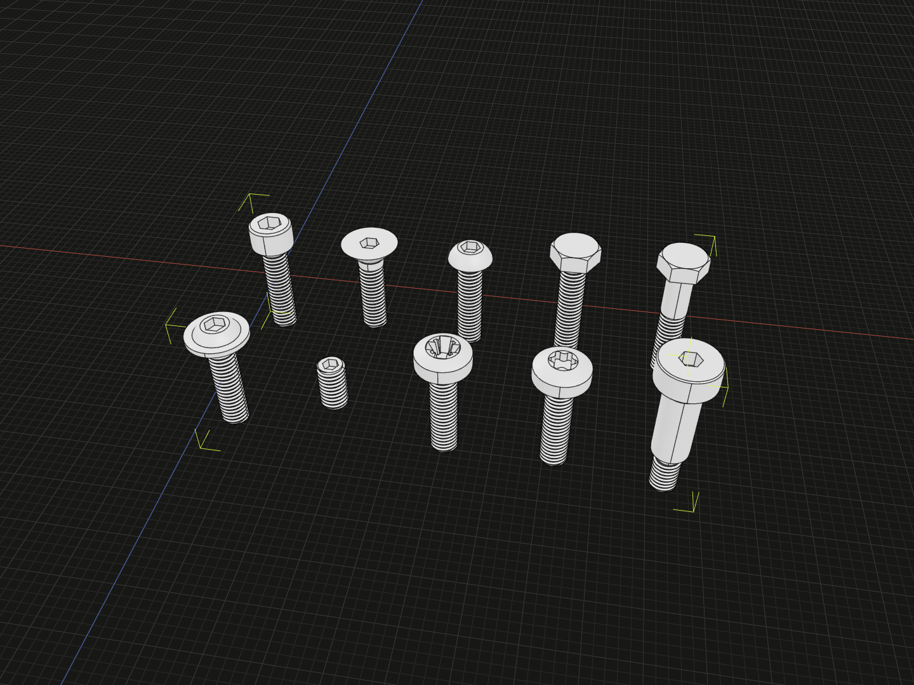

Choose a standard and nominal size, then use its screw and clearance-hole
constructors. Each standard has a public subpath; multipart numbers use hyphens
in subpaths and underscores in namespace names.

## ISO standards and sizes

Create a socket-cap screw by thread size, or a shoulder screw by shoulder diameter:

```ts
import * as ISO4762 from '@code3d/screws/iso4762';
import * as ISO7379 from '@code3d/screws/iso7379';

const socketCap = ISO4762.screw('M6', 24); // Back row, first.
const shoulder = ISO7379.screw(8, 20); // Front row, last.
```



Each row follows the table order: ISO 4762 through ISO 4014, then ISO 7380-2
through ISO 7379.
The shoulder screw uses an 8 mm shoulder; the other examples use M6 threads.

Complete example: [screw shapes and drives](../../app/examples/packages/screws.ts).
The shared gallery labels each shape with both its ISO and GB/T module name.

| Namespace   | Import subpath             | Form                               | Presets                      |
| ----------- | -------------------------- | ---------------------------------- | ---------------------------- |
| `ISO4762`   | `@code3d/screws/iso4762`   | Hexagon socket cap                 | M3–M12                       |
| `ISO10642`  | `@code3d/screws/iso10642`  | Countersunk hexagon socket         | M3–M12                       |
| `ISO7380_1` | `@code3d/screws/iso7380-1` | Button hexagon socket              | M3–M12                       |
| `ISO4017`   | `@code3d/screws/iso4017`   | Fully threaded hexagon head        | M3–M12                       |
| `ISO4014`   | `@code3d/screws/iso4014`   | Partially threaded hexagon head    | M3–M12                       |
| `ISO7380_2` | `@code3d/screws/iso7380-2` | Button hexagon socket with collar  | M3–M12                       |
| `ISO4029`   | `@code3d/screws/iso4029`   | Cup-point hexagon socket set screw | M3–M12                       |
| `ISO7045`   | `@code3d/screws/iso7045`   | H/Z cross-recessed pan head        | M3–M10                       |
| `ISO14583`  | `@code3d/screws/iso14583`  | Hexalobular pan head               | M3–M10                       |
| `ISO7379`   | `@code3d/screws/iso7379`   | Hexagon socket shoulder screw      | Shoulder Ø6.5, 8, 10, 13, 16 |

Metric presets are M3, M4, M5, M6, M8, M10, and M12 where listed. All use coarse
pitch. ISO 7379's shoulder sizes correspond to M5, M6, M8, M10, and M12 threads.

## GB/T standards

GB/T entries use `gb` followed by the standard number. A decimal part becomes
a hyphen in the subpath and an underscore in the root namespace:

```ts
import * as GB70_1 from '@code3d/screws/gb70-1';
import * as GB70_3 from '@code3d/screws/gb70-3';
import * as GB5783 from '@code3d/screws/gb5783';

const socketCap = GB70_1.screw('M6', 18);
const countersunk = GB70_3.screw('M6', 20);
const hexBolt = GB5783.screw('M6', 30);
```

The editions below are current as checked on 2026-09-12. Each standard links
to its national standards record. These entries share nominal model dimensions
and constructors with the corresponding ISO module **within the listed preset
range**, including its types, length convention, drive options and mounting
references. They do not assert that the complete GB/T and ISO product standards
are identical: the adoption is modified (MOD), except GB/T 5281 (EQV).

| Namespace | Subpath suffix | GB/T edition                                                                                      | ISO model   | Presets                      |
| --------- | -------------- | ------------------------------------------------------------------------------------------------- | ----------- | ---------------------------- |
| `GB70_1`  | `gb70-1`       | [70.1-2008](https://std.samr.gov.cn/gb/search/gbDetailed?id=71F772D7F825D3A7E05397BE0A0AB82A)     | `ISO4762`   | M3–M12                       |
| `GB70_2`  | `gb70-2`       | [70.2-2025](https://openstd.samr.gov.cn/bzgk/std/newGbInfo?hcno=6F19BF92846B48BF27058E2B5299935E) | `ISO7380_1` | M3–M12                       |
| `GB70_3`  | `gb70-3`       | [70.3-2023](https://std.samr.gov.cn/gb/search/gbDetailed?id=FC816D05003162EBE05397BE0A0AD5FA)     | `ISO10642`  | M3–M12                       |
| `GB70_4`  | `gb70-4`       | [70.4-2025](https://std.samr.gov.cn/gb/search/gbDetailed?id=42BA7D06A4DCE936E06397BE0A0ACDC9)     | `ISO7380_2` | M3–M12                       |
| `GB5782`  | `gb5782`       | [5782-2025](https://std.samr.gov.cn/gb/search/gbDetailed?id=jAnZliYiA5M%3D&mode=p)                | `ISO4014`   | M3–M12                       |
| `GB5783`  | `gb5783`       | [5783-2025](https://std.samr.gov.cn/gb/search/gbDetailed?id=42BA7D06A331E936E06397BE0A0ACDC9)     | `ISO4017`   | M3–M12                       |
| `GB818`   | `gb818`        | [818-2016](https://std.samr.gov.cn/gb/search/gbDetailed?id=71F772D813A1D3A7E05397BE0A0AB82A)      | `ISO7045`   | M3–M10                       |
| `GB2672`  | `gb2672`       | [2672-2017](https://std.samr.gov.cn/gb/search/gbDetailed?id=71F772D818CAD3A7E05397BE0A0AB82A)     | `ISO14583`  | M3–M10                       |
| `GB80`    | `gb80`         | [80-2007](https://std.samr.gov.cn/gb/search/gbDetailed?id=71F772D7890DD3A7E05397BE0A0AB82A)       | `ISO4029`   | M3–M12                       |
| `GB5281`  | `gb5281`       | [5281-1985](https://std.samr.gov.cn/gb/search/gbDetailed?id=71F772D7AF1AD3A7E05397BE0A0AB82A)     | `ISO7379`   | Shoulder Ø6.5, 8, 10, 13, 16 |

The 2025 editions of GB/T 70.2, 70.4, 5782 and 5783 took effect on
2026-02-01. Presets remain the selected coarse sizes above; additions outside
that set, such as M7 hexagon bolts and the M16 button-screw thread-length rule,
are not included. Material, strength, coating, marking and tolerance
requirements are outside the model scope. In particular, GB/T 5782/5783 use
the modern M10/M12 hexagon widths of 16/18 mm, not older 17/19 mm variants.

### GB/T clearance tools

GB/T 70.1 holes include a counterbore by default; GB/T 70.3 holes include a
90° countersink. Other headed GB/T entries accept an optional `counterbore`;
GB/T 5281 takes a numeric shoulder diameter, and GB/T 80 has no clearance-hole
constructor. The hole tools retain the ISO modules' fit and recess allowances
described below; **they do not implement the GB/T 152 countersink/counterbore
tables**. Use custom dimensions when a drawing specifies a particular hole.

```ts
import * as GB5281 from '@code3d/screws/gb5281';

const hole = GB5281.clearanceHole(8, {
  depth: 12,
  diameter: 8.5,
  counterbore: {diameter: 15, depth: 7},
});
const shoulder = GB5281.screw(8, 20).relate(part =>
  part.headBottom.on(hole.counterboreBottom),
);
```

## Specifications and drives

Each module exports `specifications`, `resolveSpecification(input)`, `Size`,
`Specification`, `ScrewInput`, and `Screw`. A supplied specification object is
returned unchanged, so callers can derive custom dimensions from a preset.

Ordinary headed modules also expose `threadLength(spec, length)`. This returns
the nominal thread length before the builder limits it to the available shaft
and allows for its under-head transition. ISO 4017 threads the entire available
shaft; ISO 4014 retains the unthreaded portion on longer bolts. ISO 7379's
threaded projection is the fixed `spec.threadLength`; ISO 4029 is fully threaded.

ISO 7045 defaults to type H and accepts `{recess: 'Z'}`. ISO 14583 selects its
hexalobular recess number and dimensions from the screw size.

```ts
import * as ISO7045 from '@code3d/screws/iso7045';

const zDrive = ISO7045.screw('M4', 16, {recess: 'Z'});
```

## Dimension sources and modeling scope

These models support layout, visualization and Boolean assembly checks.
Preset head, drive, shoulder and thread dimensions follow the linked tables;
ISO and DIN dimensions are kept distinct (notably ISO 10642 heads, M10/M12 hex
widths, and ISO 7045 M3/M5 heads).

- [ISO 10642 dimensional drawing, VIPA](https://www.vipafasteners.com/files/0/886-HEXAGON_SOCKET_COUNTERSUNK_HEAD_SCREWS_ISO_10642_UNI_5933_DIN_7991.pdf)
- [ISO 4014/4017 head and partial-thread dimensions, VIPA](https://www.vipafasteners.com/files/0/801-PARTIAL_THREAD_HEXAGON_HEAD_SCREWS_ISO_4014_UNI_5737_DIN_931.pdf)
- [ISO 7380-1, Böllhoff](https://eshop-ro.boellhoff.com/out/media/pdf/ISO_7380-1_Stahl_10.9_Innensechskant___en.pdf)
  and [ISO 7380-2, Böllhoff](https://eshop-cz.boellhoff.com/out/media/pdf/ISO_7380-2_Edelstahl_A2_Innensechskant___en.pdf)
- [ISO 4029 / DIN 916, JC Fasteners](https://www.jcfasteners.com/wp-content/uploads/DIN-916-Grub-Screw-Cup-PT-B4A07-SS304.pdf)
- [ISO 7045](https://www.finesz.com/ISO7045.php), [ISO 14583](https://www.finesz.com/ISO14583.php),
  and [ISO 7379](https://www.finesz.com/ISO7379.php), Fine Fasteners
- [ISO 10664:2014 basic hexalobular dimensions](https://cdn.standards.iteh.ai/samples/63207/f79670cf0a214881aa40b4822580cce3/ISO-10664-2014.pdf)

Threads use a swept coarse-pitch profile with faded, axially trimmed ends.
Under-head transitions and shoulder reliefs are simplified. Rounded heads
include a small flat crown around the recess. Cross recesses use tapered wings
with additional ribs for Z; hexalobular recesses use twelve tangent circular arcs
with the nominal A/B envelope. Socket bottoms omit drill-point details. Cup
points use a conical cavity and a narrow annular lip. These are nominal modeling
representations, not manufacturing or inspection-gauge geometry. Tolerance
stacks, coatings, strength grades and complete standard length series are not
modeled; positive lengths must leave room for the relevant head, relief and
thread features.
